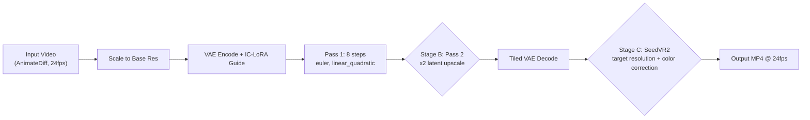

# LTX-2.3 V2V AnimateDiff Cleanup Workflows

Re-detail and clean up ~15-second AnimateDiff renders (24fps, 1080p source):
remove undescribable detail, fix blur, smooth jittery motion. Every post-LTX
stage is **bypassable** so you can test at any output resolution.

Uses **SeedVR2** (ByteDance) for diffusion-based video super-resolution with
built-in color correction and temporal coherence — replaces the need for
separate DiffVSR + Lanczos stages.

## Files

| File | Format | GPU | Use Case |
|---|---|---|---|
| [`ltx23_v2v_animatediff_cleanup_8gb.json`](ltx23_v2v_animatediff_cleanup_8gb.json) | API (flat dict) | 8GB local | RunPod serverless / programmatic |
| [`ltx23_v2v_animatediff_cleanup_8gb_ui.json`](ltx23_v2v_animatediff_cleanup_8gb_ui.json) | UI (graph) | 8GB local | ComfyUI web interface |
| [`ltx23_v2v_animatediff_cleanup_24gb.json`](ltx23_v2v_animatediff_cleanup_24gb.json) | API (flat dict) | 24GB cloud | RunPod serverless / programmatic |
| [`ltx23_v2v_animatediff_cleanup_24gb_ui.json`](ltx23_v2v_animatediff_cleanup_24gb_ui.json) | UI (graph) | 24GB cloud | ComfyUI web interface |
| [`ltx23_v2v_animatediff_retake_24gb.json`](ltx23_v2v_animatediff_retake_24gb.json) | API (flat dict) | 24GB cloud | Section repair (ReTake) |

## What It Does



### What Each Piece Fixes

| Problem | Solution |
|---|---|
| Undescribable detail / artifacts | IC-LoRA deblur + decompression + negative prompt |
| Blur | IC-LoRA deblur (trained to sharpen out-of-focus video) + SeedVR2 detail reconstruction |
| Jittery / flickering motion | LTX-2.3 native temporal DiT (22B model) + SeedVR2 temporal_overlap blending |
| Compression artifacts | IC-LoRA decompression (24GB only) |
| Low resolution | SeedVR2 diffusion-based super-resolution to target resolution |
| Color drift | SeedVR2 built-in `lab` color correction (perceptual matching to source) |
| Specific frame range still bad | ReTake workflow (LTXVAudioVideoMask section repair) |

## Prerequisites

### Models

```bash
# 8GB workflow
python scripts/download_ltx23_models.py --ids \
  gguf_distilled_q4 text_encoder video_vae \
  iclora_deblur omninft_rl_lora

# 24GB workflow
python scripts/download_ltx23_models.py --ids \
  checkpoint_fp8 distilled_lora \
  iclora_deblur iclora_decompression omninft_rl_lora \
  spatial_upscaler

# Or use profiles
./scripts/install_ltx23.sh --profile low_vram_8gb      # 8GB
./scripts/install_ltx23.sh --profile mid_vram_12_24gb  # 24GB
```

### Gated LoRAs

`iclora_deblur` and `iclora_decompression` are gated (instant-approve):

1. Visit <https://huggingface.co/Lightricks/LTX-2.3-22b-IC-LoRA-Deblur>
2. Visit <https://huggingface.co/Lightricks/LTX-2.3-22b-IC-LoRA-Decompression>
3. Click **"Agree and Access"** on each
4. Set `HF_TOKEN` before downloading:
   ```bash
   export HF_TOKEN=hf_...
   ```

### Custom Nodes

Installed by [`scripts/add-dependancies.sh`](../scripts/add-dependancies.sh):

- **ComfyUI-LTXVideo** — `LTXAddVideoICLoRAGuide`, `LTXICLoRALoaderModelOnly`,
  `LTXVLatentUpsampler`, `LTXVTiledVAEDecode`, `LTXVConditioning`
- **ComfyUI-GGUF** — `UnetLoaderGGUF` (8GB workflow only)
- **ComfyUI-KJNodes** — `LTXVAudioVideoMask` (ReTake workflow),
  `LTX2_NAG`, `LTXVEnhanceAVideoKJ` (optional enhancement nodes)
- **ComfyUI-SeedVR2_VideoUpscaler** — `SeedVR2LoadDiTModel`,
  `SeedVR2LoadVAEModel`, `SeedVR2TorchCompileSettings` (optional),
  `SeedVR2VideoUpscaler`
- **VHS (VideoHelperSuite)** — `VHS_LoadVideo`, `VHS_VideoCombine`

### SeedVR2 Models

SeedVR2 models auto-download on first use to `models/seedvr2/`:

| Model | File | Size | Used By |
|---|---|---|---|
| DiT (3B fp8) | `seedvr2_ema_3b_fp8_e4m3fn.safetensors` | ~6GB | Both workflows |
| VAE (fp16) | `ema_vae_fp16.safetensors` | ~500MB | Both workflows |

**For RunPod serverless**: pre-download to a network volume to avoid
cold-start delay:

```bash
# On a pod with the image running:
cd /comfyui/models
mkdir -p seedvr2
# SeedVR2 auto-downloads on first use — run a quick test upscale
# to trigger the download, then sync the models/seedvr2/ folder to S3/B2
```

## 8GB Workflow (RTX 2070 SUPER, Local)

### Architecture

Single-pass V2V with GGUF Q4 quantized checkpoint. No latent upscale pass
(too VRAM-intensive). SeedVR2 3B fp8 with BlockSwap provides the resolution
boost to 1080p.

### IC-LoRA Stack

| LoRA | Strength | Purpose |
|---|---|---|
| `iclora_deblur` | 0.6 | Sharpen out-of-focus / blurry video [GATED] |
| `omninft_rl_lora` | 2.0 | General quality boost (AV sync, prompt adherence) |

### Parameters

- Base resolution: 512×288
- Frame count: 361 (15s @ 24fps, 8n+1 rule)
- Single pass: 8 steps, `linear_quadratic`, `euler`, `cfg=1.0`
- Tiled VAE encode: `tile_size=256, tile_overlap=64`
- Tiled VAE decode: 2×2 tiles, overlap=2
- Text encoder: CPU offload (`device: cpu`)
- SeedVR2: 3B fp8, BlockSwap=16, CPU offload, tiled VAE (512px tiles)

### SeedVR2 Settings (8GB)

| Parameter | Value | Why |
|---|---|---|
| `model` | `seedvr2_ema_3b_fp8_e4m3fn.safetensors` | 3B fp8 — fits 8GB with BlockSwap |
| `blocks_to_swap` | 16 | Offload 16 transformer blocks to CPU |
| `offload_device` | `cpu` | CPU offload for BlockSwap |
| `encode_tiled` | `true` | Tiled encoding (512px) to reduce VRAM |
| `decode_tiled` | `true` | Tiled decoding (512px) to reduce VRAM |
| `batch_size` | 5 | 4n+1 pattern, low VRAM |
| `temporal_overlap` | 2 | Blend 2 frames between batches |
| `color_correction` | `lab` | Perceptual color matching |
| `resolution` | 1080 | Target shortest edge → 1920×1080 |

### Output Modes

| Mode | SeedVR2 (Stage C) | Output |
|---|---|---|
| Preview | OFF | 512×288 @ 24fps |
| 1080p | ON | 1920×1080 @ 24fps |

### Brave Variant

Set `resolution=2160` for 4K output (may be slow on 8GB). Or increase
`batch_size` to 9 for better temporal coherence (needs more VRAM).

## 24GB Workflow (RTX 4090, RunPod)

### Architecture

Two-pass V2V with fp8 checkpoint + full IC-LoRA stack + latent upscale +
SeedVR2 super-resolution to 4K with color correction.

### IC-LoRA Stack

| LoRA | Strength | Purpose |
|---|---|---|
| `distilled_lora` | 1.0 | **Required** — enables 8-step fast pipeline |
| `iclora_deblur` | 0.6 | Sharpen out-of-focus / blurry video [GATED] |
| `iclora_decompression` | 0.7 | Remove compression artifacts [GATED] |
| `omninft_rl_lora` | 2.0 | General quality boost |

### Parameters

- Base resolution: 768×432 (default), 960×544 (brave 1080p variant)
- Frame count: 361 (15s @ 24fps)
- Pass 1: 8 steps, `linear_quadratic`, `euler`, `cfg=1.0`, `denoise=1.0`
- Pass 2: 3 steps, `ManualSigmas` `0.85, 0.725, 0.4219, 0.0`, `euler`
- Tiled VAE decode: 1×1 tiles (default), 2×2 for brave variant
- SeedVR2: 3B fp8, no BlockSwap, model cached, no tiling

### SeedVR2 Settings (24GB)

| Parameter | Value | Why |
|---|---|---|
| `model` | `seedvr2_ema_3b_fp8_e4m3fn.safetensors` | 3B fp8 — fits 24GB without BlockSwap |
| `blocks_to_swap` | 0 | No offloading needed |
| `offload_device` | `none` | Keep model on GPU |
| `encode_tiled` | `false` | No tiling needed on 24GB |
| `decode_tiled` | `false` | No tiling needed on 24GB |
| `cache_model` | `true` | Keep loaded between runs |
| `batch_size` | 9 | 4n+1 pattern, better temporal coherence |
| `temporal_overlap` | 4 | Blend 4 frames between batches |
| `color_correction` | `lab` | Perceptual color matching — fixes drift |
| `resolution` | 2160 | Target shortest edge → ~4K from 768×432 |

### Output Modes

| Mode | Base Res | Pass 2 (Stage B) | SeedVR2 (Stage C) | SeedVR2 resolution | Output |
|---|---|---|---|---|---|
| Preview | 768×432 | OFF | OFF | — | 768×432 @ 24fps |
| Default | 768×432 | ON | OFF | — | 1536×864 @ 24fps |
| 1080p | 768×432 | ON | ON | 1080 | 1920×1080 @ 24fps |
| 4K | 768×432 | OFF | ON | 2160 | 3072×1728 @ 24fps |

> For 1080p: set SeedVR2 `resolution=1080`. For 4K: set `resolution=2160`.
> The `resolution` parameter sets the target shortest edge — SeedVR2
> maintains aspect ratio automatically.

### Brave Variant: True 1080p Base

Change `ImageScale` node to 960×544:
- Pass 2 → 1920×1088 (exact 1080p)
- SeedVR2 `resolution=1080` to clean up at native resolution
- Risk: OOM at 361 frames. Mitigations:
  - Set `use_tiled_encode=true` on `LTXAddVideoICLoRAGuide`
  - Set `LTXVTiledVAEDecode` to 2×2 tiles
  - Use `COMFYUI_ARGS=--lowvram`
  - Reduce `frame_load_cap` to 241 (10s)

## Bypassing Stages

### In ComfyUI Web Interface (UI format)

Load the `_ui.json` file. Stages are grouped with colored bounding boxes:

- **Stage B** (24GB only): Pass 2 Latent Upscale — green group
- **Stage C**: SeedVR2 Upscale — green group

Right-click any node in a stage → **Bypass** (or select all nodes in the
group with Ctrl+A inside the bounding box, then right-click → Bypass).
ComfyUI auto-reroutes the signal through the bypassed node unchanged.

### Via API (serverless / programmatic)

API format has no bypass flag. Toggle stages by rewiring the `images` input
on `VHS_VideoCombine` (node `"21"`):

**8GB — Preview mode (bypass SeedVR2):**
```python
# Point VideoCombine directly at VAE decode output
workflow["21"]["inputs"]["images"] = ["20", 0]  # was ["32", 0]
```

**8GB — 1080p mode (default, SeedVR2 on):**
```python
# No changes needed — workflow ships in this mode
```

**24GB — Preview mode (bypass Pass 2 + SeedVR2):**
```python
# Point VideoCombine at Pass 1 VAE decode
workflow["21"]["inputs"]["images"] = ["20", 0]  # was ["32", 0]
# Also rewire VAE decode input to Pass 1 output (skip Pass 2)
workflow["20"]["inputs"]["latents"] = ["15", 0]  # was ["19", 0]
```

**24GB — Default mode (Pass 2 on, SeedVR2 off):**
```python
# Point VideoCombine at Pass 2 VAE decode
workflow["21"]["inputs"]["images"] = ["20", 0]  # was ["32", 0]
```

**24GB — 4K mode (Pass 2 off, SeedVR2 on):**
```python
# Rewire VAE decode to Pass 1 output (skip Pass 2)
workflow["20"]["inputs"]["latents"] = ["15", 0]  # was ["19", 0]
# SeedVR2 stays on (default wiring), set resolution to 2160
workflow["32"]["inputs"]["resolution"] = 2160
```

**24GB — 1080p mode (Pass 2 + SeedVR2 on):**
```python
# Pass 2 + SeedVR2 both on (default wiring)
workflow["32"]["inputs"]["resolution"] = 1080  # was 2160
```

## SeedVR2 Color Correction Modes

SeedVR2's built-in color correction fixes color shifts introduced by the
upscaling process. Available modes:

| Mode | Description | Best For |
|---|---|---|
| `lab` | Perceptual color matching with detail preservation | **Default** — most cases |
| `wavelet` | Frequency-based natural colors, preserves fine details | Detailed textures |
| `wavelet_adaptive` | Wavelet base with targeted saturation correction | Oversaturated output |
| `hsv` | Hue-conditional saturation matching | Hue-shifted output |
| `adain` | Statistical style transfer approach | Dramatic restyling |
| `none` | No color correction | When source is already correct |

## ReTake: Section Repair

[`ltx23_v2v_animatediff_retake_24gb.json`](ltx23_v2v_animatediff_retake_24gb.json)
is a follow-up workflow for when specific frame ranges in your video are still
problematic after the main cleanup pass. It uses KJNodes'
`LTXVAudioVideoMask` to regenerate only the masked temporal region while
leaving the rest of the video untouched.

### How It Works

1. Load the cleanup-pass output video
2. VAE encode to latents
3. `LTXVAudioVideoMask` sets a `noise_mask` on the latent — only frames in
   the specified time range get noise (regenerated); all other frames pass
   through unchanged
4. `SamplerCustomAdvanced` samples with the masked latent — new content is
   generated only within the masked region
5. VAE decode + save

### Key Parameters

| Parameter | Default | Description |
|---|---|---|
| `video_start_time` | 5.0 | Start of the section to regenerate (seconds) |
| `video_end_time` | 8.0 | End of the section to regenerate (seconds) |
| `video_fps` | 24 | Must match the input video's fps |
| `max_length` | `partial` | `partial` = mask within existing latent; `truncate` = cut to end_time; `pad` = extend |
| `existing_mask_mode` | `overwrite` | `overwrite` = replace any existing mask; `add` = take max; `subtract` = unmask |

### Usage

```python
import json

with open('examples/ltx23_v2v_animatediff_retake_24gb.json') as f:
    workflow = json.load(f)

# Set the input video (output from the cleanup pass)
workflow["9"]["inputs"]["video"] = "ltx23_v2v_animatediff_cleanup_24gb_00001.mp4"

# Set the time range to regenerate (e.g. frames 120-192 = 5.0s-8.0s at 24fps)
workflow["mask"]["inputs"]["video_start_time"] = 5.0
workflow["mask"]["inputs"]["video_end_time"] = 8.0

# Change the seed for different regeneration results
workflow["15a"]["inputs"]["noise_seed"] = 123

job_input = {'workflow': workflow}
```

### Multiple Sections

To regenerate multiple non-adjacent sections, run the workflow multiple
times — each run feeds the previous output as input, with a different
`video_start_time`/`video_end_time` range. Chain up to ~5 runs before
cumulative drift becomes visible.

## Usage

### In ComfyUI Web Interface

1. Load the `_ui.json` file via "Load" in the ComfyUI menu
2. Update the `VHS_LoadVideo` node with your input video path
3. Adjust prompts in the `CLIPTextEncode` nodes
4. Adjust IC-LoRA strengths in the `LTXICLoRALoaderModelOnly` nodes
5. Adjust SeedVR2 `resolution` parameter for target output size
6. Bypass stages as needed for your target output resolution
7. Queue prompt

### Via RunPod Serverless Handler

```python
import json

with open('examples/ltx23_v2v_animatediff_cleanup_24gb.json') as f:
    workflow = json.load(f)

# Override input video
workflow["9"]["inputs"]["video"] = "my_animatediff_clip.mp4"

# Override prompts
workflow["7"]["inputs"]["text"] = "cinematic, sharp focus, smooth motion, detailed, high quality"
workflow["8"]["inputs"]["text"] = "blurry, artifacts, noise, flickering, jittery motion, distorted, low quality"

# Set SeedVR2 target resolution (1080 for 1080p, 2160 for 4K)
workflow["32"]["inputs"]["resolution"] = 1080

# For preview mode (bypass SeedVR2):
workflow["21"]["inputs"]["images"] = ["20", 0]

job_input = {'workflow': workflow}
```

### Local Testing

```bash
# 8GB workflow
IMAGE_NAME=comfyui-serverless:local ./scripts/test_local.sh \
  examples/ltx23_v2v_animatediff_cleanup_8gb.json

# 24GB workflow
IMAGE_NAME=comfyui-serverless:local ./scripts/test_local.sh \
  examples/ltx23_v2v_animatediff_cleanup_24gb.json
```

## VRAM

| GPU | VRAM | Workflow | SeedVR2 Config | Notes |
|---|---|---|---|---|
| RTX 2070 SUPER | 8GB | `_8gb` | 3B fp8, BlockSwap=16, tiled VAE | CPU offload, batch_size=5 |
| RTX 4090 / 3090 | 24GB | `_24gb` | 3B fp8, no BlockSwap, no tiling | Model cached, batch_size=9 |
| RTX 5090 | 32GB | `_24gb` | 3B fp8, no BlockSwap | Can use 7B model if available |

### OOM Troubleshooting

**8GB:**
- Increase `blocks_to_swap` on SeedVR2 DiT loader (up to 32 for 3B model)
- Reduce `batch_size` to 1 (minimum, no temporal coherence)
- Enable `encode_tiled` and `decode_tiled` on SeedVR2 VAE loader
- Reduce `encode_tile_size` / `decode_tile_size` to 256
- Reduce `frame_load_cap` to 241 (10s)
- Use `COMFYUI_ARGS=--lowvram`
- Bypass SeedVR2 entirely (preview mode)

**24GB:**
- Bypass Pass 2 (use preview mode)
- Set `use_tiled_encode=true` on `LTXAddVideoICLoRAGuide`
- Set `LTXVTiledVAEDecode` to 2×2 tiles
- Enable SeedVR2 VAE tiling (`encode_tiled=true`, `decode_tiled=true`)
- Reduce `frame_load_cap` to 241 (10s)
- Use `COMFYUI_ARGS=--lowvram`
- Drop `iclora_decompression` (keep `iclora_deblur` + `omninft_rl_lora`)

## Cost Estimate (RunPod, 24GB)

For a 15-second clip at 4K settings (Pass 2 on, SeedVR2 resolution=2160):

| Step | GPU | Time | Cost |
|---|---|---|---|
| Pass 1 (8 steps, 768×432, 361f) | RTX 4090 | ~3 min | $0.01 |
| Pass 2 (3 steps, 1536×864, 361f) | RTX 4090 | ~2 min | $0.01 |
| SeedVR2 3B (1536×864 → 3072×1728, 361f, batch=9) | RTX 4090 | ~8 min | $0.04 |
| **Total per clip** | **RTX 4090** | **~13 min** | **~$0.06** |

Preview mode (Pass 1 only): ~3 min, ~$0.01 per clip.
1080p mode (Pass 2 + SeedVR2 resolution=1080): ~10 min, ~$0.05 per clip.

## Troubleshooting

### SeedVR2 model download fails

SeedVR2 models auto-download on first use. If the download fails:

1. Check internet connectivity
2. Manually download to `models/seedvr2/`:
   ```bash
   cd /comfyui/models
   mkdir -p seedvr2
   # Download from HuggingFace (check SeedVR2 repo for exact URLs)
   huggingface-cli download numz/seedvr2 --local-dir seedvr2
   ```
3. For RunPod: pre-download to network volume

### Color drift on Pass 2

The 2× upscaled latent runs outside the model's trained spatial-token-count
range. SeedVR2's `lab` color correction should handle this automatically.
If drift persists:
- Try `wavelet_adaptive` color correction mode
- Use 768×432 base (default) instead of 960×544
- Bypass Pass 2 and rely on SeedVR2 for resolution boost

### Edges not landing (model ignoring prompt)

Raise CFG from 1.0 to 3-6. This requires dropping `distilled_lora` and
increasing steps from 8 to 20-30. See
[`docs/LTX_2.3_WORKFLOW_ENHANCEMENTS.md`](../docs/LTX_2.3_WORKFLOW_ENHANCEMENTS.md:217).

### SeedVR2 too slow

- Reduce `batch_size` (fewer frames per batch = less compute but more batches)
- Reduce `resolution` (1080 instead of 2160)
- Add `SeedVR2TorchCompileSettings` node with `mode=max-autotune` for 20-40%
  speedup (requires PyTorch 2.0+ and Triton)
- Use `attention_mode: flash_attn_2` if flash-attn is installed
- Bypass SeedVR2 and use LTX output directly (preview mode)

### SeedVR2 OOM

- Increase `blocks_to_swap` (offloads more transformer blocks to CPU)
- Enable VAE tiling (`encode_tiled=true`, `decode_tiled=true`)
- Reduce tile sizes to 256
- Reduce `batch_size` to 1
- Reduce `frame_load_cap` (shorter video)
