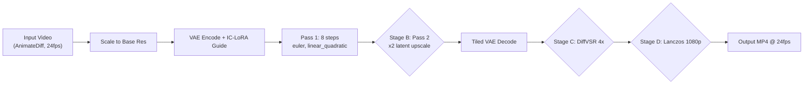

# LTX-2.3 V2V AnimateDiff Cleanup Workflows

Re-detail and clean up ~15-second AnimateDiff renders (24fps, 1080p source):
remove undescribable detail, fix blur, smooth jittery motion. Every post-LTX
stage is **bypassable** so you can test at any output resolution.

## Files

| File | Format | GPU | Use Case |
|---|---|---|---|
| [`ltx23_v2v_animatediff_cleanup_8gb.json`](ltx23_v2v_animatediff_cleanup_8gb.json) | API (flat dict) | 8GB local | RunPod serverless / programmatic |
| [`ltx23_v2v_animatediff_cleanup_8gb_ui.json`](ltx23_v2v_animatediff_cleanup_8gb_ui.json) | UI (graph) | 8GB local | ComfyUI web interface |
| [`ltx23_v2v_animatediff_cleanup_24gb.json`](ltx23_v2v_animatediff_cleanup_24gb.json) | API (flat dict) | 24GB cloud | RunPod serverless / programmatic |
| [`ltx23_v2v_animatediff_cleanup_24gb_ui.json`](ltx23_v2v_animatediff_cleanup_24gb_ui.json) | UI (graph) | 24GB cloud | ComfyUI web interface |
| [`ltx23_v2v_animatediff_retake_24gb.json`](ltx23_v2v_animatediff_retake_24gb.json) | API (flat dict) | 24GB cloud | Section repair (ReTake) |

## What It Does



### What Each Piece Fixes

| Problem | Solution |
|---|---|
| Undescribable detail / artifacts | IC-LoRA deblur + decompression + negative prompt |
| Blur | IC-LoRA deblur (trained to sharpen out-of-focus video) + DiffVSR detail reconstruction |
| Jittery / flickering motion | LTX-2.3 native temporal DiT (22B model, not bolt-on motion module) |
| Compression artifacts | IC-LoRA decompression (24GB only) |
| Low resolution | DiffVSR 4x super-resolution with temporal coherence |
| Specific frame range still bad | ReTake workflow (LTXVAudioVideoMask section repair) |

## Prerequisites

### Models

```bash
# 8GB workflow
python scripts/download_ltx23_models.py --ids \
  gguf_distilled_q4 text_encoder video_vae \
  iclora_deblur omninft_rl_lora

# 24GB workflow
python scripts/download_ltx23_models.py --ids \
  checkpoint_fp8 distilled_lora \
  iclora_deblur iclora_decompression omninft_rl_lora \
  spatial_upscaler

# Or use profiles
./scripts/install_ltx23.sh --profile low_vram_8gb      # 8GB
./scripts/install_ltx23.sh --profile mid_vram_12_24gb  # 24GB
```

### Gated LoRAs

`iclora_deblur` and `iclora_decompression` are gated (instant-approve):

1. Visit <https://huggingface.co/Lightricks/LTX-2.3-22b-IC-LoRA-Deblur>
2. Visit <https://huggingface.co/Lightricks/LTX-2.3-22b-IC-LoRA-Decompression>
3. Click **"Agree and Access"** on each
4. Set `HF_TOKEN` before downloading:
   ```bash
   export HF_TOKEN=hf_...
   ```

### Custom Nodes

Installed by [`scripts/add-dependancies.sh`](../scripts/add-dependancies.sh):

- **ComfyUI-LTXVideo** — `LTXAddVideoICLoRAGuide`, `LTXICLoRALoaderModelOnly`,
  `LTXVLatentUpsampler`, `LTXVTiledVAEDecode`, `LTXVConditioning`
- **ComfyUI-GGUF** — `UnetLoaderGGUF` (8GB workflow only)
- **ComfyUI-KJNodes** — `LTXVAudioVideoMask` (ReTake workflow),
  `LTX2_NAG`, `LTXVEnhanceAVideoKJ` (optional enhancement nodes)
- **ComfyUI-FL-DiffVSR** — `FL_DiffVSR_LoadModel`, `FL_DiffVSR_Upscale`
- **VHS (VideoHelperSuite)** — `VHS_LoadVideo`, `VHS_VideoCombine`

### DiffVSR Model

The Stream-DiffVSR model (~2GB) auto-downloads from
`Jamichsu/Stream-DiffVSR` on HuggingFace to `models/stream_diffvsr/` on first
use. It's a multi-component model (unet, controlnet, vae, text_encoder,
tokenizer, scheduler) — not a single safetensors file, so it's not in the
model manifest.

**For RunPod serverless**: pre-download to a network volume to avoid
cold-start delay:

```bash
# On a pod with the image running:
cd /comfyui/models
python -c "
from huggingface_hub import snapshot_download
snapshot_download(
    repo_id='Jamichsu/Stream-DiffVSR',
    local_dir='stream_diffvsr',
    ignore_patterns=['*.md', '*.txt', '.git*', '*.py', '*.yml', '*.yaml']
)
"
# Then sync to S3/B2 network volume
```

### xformers

DiffVSR defaults to `enable_xformers: false` in these workflows because
xformers availability varies by image build. If your image has xformers
installed (check `pip show xformers`), set it to `true` in the
`FL_DiffVSR_LoadModel` node for better memory efficiency.

## 8GB Workflow (RTX 2070 SUPER, Local)

### Architecture

Single-pass V2V with GGUF Q4 quantized checkpoint. No latent upscale pass
(too VRAM-intensive). DiffVSR 4x provides the resolution boost.

### IC-LoRA Stack

| LoRA | Strength | Purpose |
|---|---|---|
| `iclora_deblur` | 0.6 | Sharpen out-of-focus / blurry video [GATED] |
| `omninft_rl_lora` | 2.0 | General quality boost (AV sync, prompt adherence) |

### Parameters

- Base resolution: 512×288
- Frame count: 361 (15s @ 24fps, 8n+1 rule)
- Single pass: 8 steps, `linear_quadratic`, `euler`, `cfg=1.0`
- Tiled VAE encode: `tile_size=256, tile_overlap=64`
- Tiled VAE decode: 2×2 tiles, overlap=2
- Text encoder: CPU offload (`device: cpu`)
- DiffVSR: fp16, `chunk_size=4`, `inference_steps=4`, `guidance=0.0`

### Output Modes

| Mode | DiffVSR (Stage C) | Lanczos 1080p (Stage D) | Output |
|---|---|---|---|
| Preview | OFF | OFF | 512×288 @ 24fps |
| ~2K | ON | OFF | 2048×1152 @ 24fps |
| 1080p | ON | ON | 1920×1080 @ 24fps |

### Brave Variant

Base res 640×352 → DiffVSR → 2560×1408. May OOM on 8GB. If it does:
- Reduce `chunk_size` to 2
- Reduce `frame_load_cap` to 241 (10s)
- Use `COMFYUI_ARGS=--lowvram`

## 24GB Workflow (RTX 4090, RunPod)

### Architecture

Two-pass V2V with fp8 checkpoint + full IC-LoRA stack + latent upscale +
optional DiffVSR 4x detailing.

### IC-LoRA Stack

| LoRA | Strength | Purpose |
|---|---|---|
| `distilled_lora` | 1.0 | **Required** — enables 8-step fast pipeline |
| `iclora_deblur` | 0.6 | Sharpen out-of-focus / blurry video [GATED] |
| `iclora_decompression` | 0.7 | Remove compression artifacts [GATED] |
| `omninft_rl_lora` | 2.0 | General quality boost |

### Parameters

- Base resolution: 768×432 (default), 960×544 (brave 1080p variant)
- Frame count: 361 (15s @ 24fps)
- Pass 1: 8 steps, `linear_quadratic`, `euler`, `cfg=1.0`, `denoise=1.0`
- Pass 2: 3 steps, `ManualSigmas` `0.85, 0.725, 0.4219, 0.0`, `euler`
- Tiled VAE decode: 1×1 tiles (default), 2×2 for brave variant
- DiffVSR: fp16, `chunk_size=8`, `inference_steps=4`, `guidance=0.0`

### Output Modes

| Mode | Base Res | Pass 2 (Stage B) | DiffVSR (Stage C) | Lanczos (Stage D) | Output |
|---|---|---|---|---|---|
| Preview | 768×432 | OFF | OFF | OFF | 768×432 @ 24fps |
| Default | 768×432 | ON | OFF | OFF | 1536×864 @ 24fps |
| 3K | 768×432 | OFF | ON | OFF | 3072×1728 @ 24fps |
| 1080p exact | 960×544 | ON | OFF | OFF | 1920×1088 @ 24fps |
| 4K | 960×544 | OFF | ON | ON | 3840×2176 @ 24fps |

> **Never run Pass 2 + DiffVSR together at 960×544 base** — that produces
> 7680×4352, which is pointless and will OOM.

### Brave Variant: True 1080p Base

Change `ImageScale` node to 960×544:
- Pass 2 → 1920×1088 (exact 1080p, no DiffVSR needed)
- Risk: OOM at 361 frames. Mitigations:
  - Set `use_tiled_encode=true` on `LTXAddVideoICLoRAGuide`
  - Set `LTXVTiledVAEDecode` to 2×2 tiles
  - Use `COMFYUI_ARGS=--lowvram`
  - Reduce `frame_load_cap` to 241 (10s)

## Bypassing Stages

### In ComfyUI Web Interface (UI format)

Load the `_ui.json` file. Stages are grouped with colored bounding boxes:

- **Stage B** (24GB only): Pass 2 Latent Upscale — green group
- **Stage C**: DiffVSR 4x Upscale — green group
- **Stage D**: Lanczos 1080p — green group

Right-click any node in a stage → **Bypass** (or select all nodes in the
group with Ctrl+A inside the bounding box, then right-click → Bypass).
ComfyUI auto-reroutes the signal through the bypassed node unchanged.

### Via API (serverless / programmatic)

API format has no bypass flag. Toggle stages by rewiring the `images` input
on `VHS_VideoCombine` (node `"21"`):

**8GB — Preview mode (bypass DiffVSR + Lanczos):**
```python
# Point VideoCombine directly at VAE decode output
workflow["21"]["inputs"]["images"] = ["20", 0]  # was ["32", 0]
```

**8GB — ~2K mode (DiffVSR on, Lanczos off):**
```python
# Point VideoCombine at DiffVSR output (skip Lanczos)
workflow["21"]["inputs"]["images"] = ["31", 0]  # was ["32", 0]
```

**8GB — 1080p mode (default, all stages on):**
```python
# No changes needed — workflow ships in this mode
```

**24GB — Preview mode (bypass Pass 2 + DiffVSR + Lanczos):**
```python
# Point VideoCombine at Pass 1 VAE decode
workflow["21"]["inputs"]["images"] = ["20", 0]  # was ["32", 0]
# Also rewire VAE decode input to Pass 1 output (skip Pass 2)
workflow["20"]["inputs"]["latents"] = ["15", 0]  # was ["19", 0]
```

**24GB — Default mode (Pass 2 on, DiffVSR + Lanczos off):**
```python
# Point VideoCombine at Pass 2 VAE decode
workflow["21"]["inputs"]["images"] = ["20", 0]  # was ["32", 0]
```

**24GB — 3K mode (Pass 2 off, DiffVSR on, Lanczos off):**
```python
# Rewire VAE decode to Pass 1 output (skip Pass 2)
workflow["20"]["inputs"]["latents"] = ["15", 0]  # was ["19", 0]
# Point VideoCombine at DiffVSR output (skip Lanczos)
workflow["21"]["inputs"]["images"] = ["31", 0]  # was ["32", 0]
```

**24GB — 4K mode (Pass 2 off, DiffVSR + Lanczos on):**
```python
# Rewire VAE decode to Pass 1 output (skip Pass 2)
workflow["20"]["inputs"]["latents"] = ["15", 0]  # was ["19", 0]
# DiffVSR + Lanczos stay on (default wiring)
```

## ReTake: Section Repair

[`ltx23_v2v_animatediff_retake_24gb.json`](ltx23_v2v_animatediff_retake_24gb.json)
is a follow-up workflow for when specific frame ranges in your video are still
problematic after the main cleanup pass. It uses KJNodes'
`LTXVAudioVideoMask` to regenerate only the masked temporal region while
leaving the rest of the video untouched.

### How It Works

1. Load the cleanup-pass output video
2. VAE encode to latents
3. `LTXVAudioVideoMask` sets a `noise_mask` on the latent — only frames in
   the specified time range get noise (regenerated); all other frames pass
   through unchanged
4. `SamplerCustomAdvanced` samples with the masked latent — new content is
   generated only within the masked region
5. VAE decode + save

### Key Parameters

| Parameter | Default | Description |
|---|---|---|
| `video_start_time` | 5.0 | Start of the section to regenerate (seconds) |
| `video_end_time` | 8.0 | End of the section to regenerate (seconds) |
| `video_fps` | 24 | Must match the input video's fps |
| `max_length` | `partial` | `partial` = mask within existing latent; `truncate` = cut to end_time; `pad` = extend |
| `existing_mask_mode` | `overwrite` | `overwrite` = replace any existing mask; `add` = take max; `subtract` = unmask |

### Usage

```python
import json

with open('examples/ltx23_v2v_animatediff_retake_24gb.json') as f:
    workflow = json.load(f)

# Set the input video (output from the cleanup pass)
workflow["9"]["inputs"]["video"] = "ltx23_v2v_animatediff_cleanup_24gb_00001.mp4"

# Set the time range to regenerate (e.g. frames 120-192 = 5.0s-8.0s at 24fps)
workflow["mask"]["inputs"]["video_start_time"] = 5.0
workflow["mask"]["inputs"]["video_end_time"] = 8.0

# Change the seed for different regeneration results
workflow["15a"]["inputs"]["noise_seed"] = 123

job_input = {'workflow': workflow}
```

### Multiple Sections

To regenerate multiple non-adjacent sections, run the workflow multiple
times — each run feeds the previous output as input, with a different
`video_start_time`/`video_end_time` range. Chain up to ~5 runs before
cumulative drift becomes visible.

## Usage

### In ComfyUI Web Interface

1. Load the `_ui.json` file via "Load" in the ComfyUI menu
2. Update the `VHS_LoadVideo` node with your input video path
3. Adjust prompts in the `CLIPTextEncode` nodes
4. Adjust IC-LoRA strengths in the `LTXICLoRALoaderModelOnly` nodes
5. Bypass stages as needed for your target output resolution
6. Queue prompt

### Via RunPod Serverless Handler

```python
import json

with open('examples/ltx23_v2v_animatediff_cleanup_24gb.json') as f:
    workflow = json.load(f)

# Override input video
workflow["9"]["inputs"]["video"] = "my_animatediff_clip.mp4"

# Override prompts
workflow["7"]["inputs"]["text"] = "cinematic, sharp focus, smooth motion, detailed, high quality"
workflow["8"]["inputs"]["text"] = "blurry, artifacts, noise, flickering, jittery motion, distorted, low quality"

# For preview mode (bypass DiffVSR + Lanczos):
workflow["21"]["inputs"]["images"] = ["20", 0]

job_input = {'workflow': workflow}
```

### Local Testing

```bash
# 8GB workflow
IMAGE_NAME=comfyui-serverless:local ./scripts/test_local.sh \
  examples/ltx23_v2v_animatediff_cleanup_8gb.json

# 24GB workflow
IMAGE_NAME=comfyui-serverless:local ./scripts/test_local.sh \
  examples/ltx23_v2v_animatediff_cleanup_24gb.json
```

## VRAM

| GPU | VRAM | Workflow | Notes |
|---|---|---|---|
| RTX 2070 SUPER | 8GB | `_8gb` | GGUF Q4, CPU text encoder, 2×2 VAE tiles, DiffVSR chunk_size=4 |
| RTX 4090 / 3090 | 24GB | `_24gb` | fp8, full LoRA stack, 1×1 VAE tiles, DiffVSR chunk_size=8 |
| RTX 5090 | 32GB | `_24gb` | Comfortable — can use 960×544 base + brave 1080p variant |

### OOM Troubleshooting

**8GB:**
- Reduce `chunk_size` on DiffVSR to 2
- Reduce `frame_load_cap` to 241 (10s)
- Use `COMFYUI_ARGS=--lowvram`
- Bypass DiffVSR entirely (preview mode)

**24GB:**
- Bypass Pass 2 (use preview mode)
- Set `use_tiled_encode=true` on `LTXAddVideoICLoRAGuide`
- Set `LTXVTiledVAEDecode` to 2×2 tiles
- Reduce `frame_load_cap` to 241 (10s)
- Use `COMFYUI_ARGS=--lowvram`
- Drop `iclora_decompression` (keep `iclora_deblur` + `omninft_rl_lora`)

## Cost Estimate (RunPod, 24GB)

For a 15-second clip at default settings (Pass 2 on, DiffVSR on):

| Step | GPU | Time | Cost |
|---|---|---|---|
| Pass 1 (8 steps, 768×432, 361f) | RTX 4090 | ~3 min | $0.01 |
| Pass 2 (3 steps, 1536×864, 361f) | RTX 4090 | ~2 min | $0.01 |
| DiffVSR 4x (1536×864 → 6144×3456, 361f, chunk=8) | RTX 4090 | ~15 min | $0.07 |
| Lanczos 1080p | RTX 4090 | <1 min | <$0.01 |
| **Total per clip** | **RTX 4090** | **~21 min** | **~$0.10** |

Preview mode (Pass 1 only): ~3 min, ~$0.01 per clip.

## Troubleshooting

### DiffVSR model download fails

The Stream-DiffVSR model downloads from `Jamichsu/Stream-DiffVSR` on
HuggingFace. If the download fails:

1. Check internet connectivity
2. Ensure `huggingface_hub` is installed (`pip install huggingface_hub`)
3. Manually download:
   ```bash
   cd /comfyui/models
   git clone https://huggingface.co/Jamichsu/Stream-DiffVSR stream_diffvsr
   ```
4. For RunPod: pre-download to network volume (see Prerequisites above)

### Color drift on Pass 2

The 2× upscaled latent runs outside the model's trained spatial-token-count
range. Options:
- Accept minor drift (usually subtle for abstract content)
- Use 768×432 base (default) instead of 960×544
- Bypass Pass 2 and rely on DiffVSR for resolution boost

### Edges not landing (model ignoring prompt)

Raise CFG from 1.0 to 3-6. This requires dropping `distilled_lora` and
increasing steps from 8 to 20-30. See
[`docs/LTX_2.3_WORKFLOW_ENHANCEMENTS.md`](../docs/LTX_2.3_WORKFLOW_ENHANCEMENTS.md:217).

### DiffVSR too slow

- Reduce `inference_steps` from 4 to 2 (lower quality, faster)
- Reduce `chunk_size` (less VRAM but more chunks = slower)
- Bypass DiffVSR and use Lanczos-only scaling (fastest, no AI detail)
