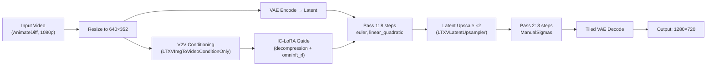

# LTX-2.3 V2V Music Visuals Patching Workflow

Fix bad AnimateDiff renders and add style to music video footage using
LTX-2.3's video-to-video IC-LoRA pipeline. Designed for abstract/music
visual content — no lip-sync or character consistency concerns.

## Files

| File | Format | Use Case |
|---|---|---|
| [`ltx23_v2v_music_visuals_patch.json`](ltx23_v2v_music_visuals_patch.json) | API (flat dict) | RunPod serverless handler, programmatic submission |
| [`ltx23_v2v_music_visuals_patch_ui.json`](ltx23_v2v_music_visuals_patch_ui.json) | UI (graph) | Load directly in ComfyUI web interface |

## What It Does



## Prerequisites

### Models

```bash
# Download required models
python scripts/download_ltx23_models.py --ids \
  checkpoint_fp8 distilled_lora \
  iclora_decompression omninft_rl_lora \
  spatial_upscaler
```

### Gated Repos

`iclora_decompression` is gated (instant-approve):

1. Visit <https://huggingface.co/Lightricks/LTX-2.3-22b-IC-LoRA-Decompression>
2. Click **"Agree and Access"**
3. Set `HF_TOKEN` before downloading:
   ```bash
   export HF_TOKEN=hf_...
   ```

### Custom Nodes

Already installed by [`scripts/install_ltx23.sh`](../scripts/install_ltx23.sh):

- **ComfyUI-LTXVideo** — `LTXVImgToVideoConditionOnly`, `LTXICLoRALoaderModelOnly`,
  `LTXAddVideoICLoRAGuide`, `LTXVLatentUpsampler`, `LTXVTiledVAEDecode`
- **ComfyUI-GGUF** — only needed if using GGUF quantized checkpoints instead of fp8
- **VHS (VideoHelperSuite)** — `VHS_LoadVideo`, `VHS_VideoCombine`

### VRAM

| GPU | VRAM | Profile | Notes |
|---|---|---|---|
| RTX 4090 / 3090 | 24GB | `mid_vram_12_24gb` | Sweet spot — fp8 + distilled + 2 IC-LoRAs |
| RTX 5090 | 32GB | `mid_vram_12_24gb` | Comfortable — stack 3+ LoRAs, audio enabled |
| A100 80GB | 80GB | `minimal` | Overkill — batch segments without VRAM management |

On 24GB: disable audio in the workflow (bypass `LTXVAudioVAELoader` and related
nodes) to reclaim ~2-3GB. See
[`docs/LTX_2.3_V2V_ICLORA_SETUP.md`](../docs/LTX_2.3_V2V_ICLORA_SETUP.md:119)
for details.

## Key Parameters

### Denoise (the main "how much to patch" lever)

| Denoise | Effect | Use When |
|---|---|---|
| 0.3-0.4 | Subtle fix — smooths flicker, removes artifacts | Clips are mostly OK, just need cleanup |
| 0.4-0.5 | Fix + light restyle — **recommended default** | Bad clips that need fixing + a style bump |
| 0.5-0.7 | Moderate restyle — visible style change | Want a different look while keeping motion |
| 0.7-1.0 | Full regeneration — source as ghost guide only | Source is unusable, keep only the motion timing |

> **Note:** The official distilled workflow uses `denoise=1.0` (full generation
> from noise, conditioned on input). Lowering denoise below 1.0 with the
> distilled LoRA may produce unexpected results — the distilled LoRA was
> trained for the specific 8-step sigma schedule. For denoise < 1.0, consider
> dropping `distilled_lora` and using 20-30 steps with a standard scheduler.
> See [`docs/LTX_2.3_WORKFLOW_ENHANCEMENTS.md`](../docs/LTX_2.3_WORKFLOW_ENHANCEMENTS.md:217).

### IC-LoRA Stack

The workflow ships with three LoRAs stacked:

| LoRA | Strength | Purpose |
|---|---|---|
| `distilled_lora` | 1.0 | **Required** — enables 8-step fast pipeline |
| `iclora_decompression` | 0.7 | Removes compression artifacts from re-encoded footage |
| `omninft_rl_lora` | 2.0 | General quality boost (AV sync, prompt adherence) |

> `omninft_rl_lora` uses strength 2.0 (not 1.0) to match its training config
> (alpha=64/rank=32). Source license is "research use only" — verify before
> commercial deployment. See
> [`config/ltx-2.3-models.json`](../config/ltx-2.3-models.json:235).

### Swap LoRAs for Different Effects

| Want | Remove | Add | Strength |
|---|---|---|---|
| Beat-driven visuals | — | `audio_reactive` | 0.6-0.8 |
| Day → night relight | — | `iclora_day_to_night` | 0.7-0.9 |
| Sharpen blurry footage | — | `iclora_deblur` | 0.5-0.7 |
| Dramatic style transfer | `distilled_lora` | `editanything_multitask` | 1.0 |
| Water VFX | — | `iclora_water_simulation` | 0.6-0.8 |

For `editanything_multitask` style transfer, use the prompt format:
`Convert the video into a <STYLE NAME> style.` (300+ trained style names).
Raise CFG to 3-6 and increase steps to 20-30. See
[`docs/LTX_2.3_WORKFLOW_ENHANCEMENTS.md`](../docs/LTX_2.3_WORKFLOW_ENHANCEMENTS.md:213).

## Segment Handling

LTX-2.3 processes a maximum of ~385 frames (~16s at 24fps) per generation.
For longer footage:

1. Split input into ≤16s segments at natural cut points
2. Process each segment independently through the workflow
3. Chain segments: feed last frame of segment A as first frame of segment B
   via `LTXVImgToVideoConditionOnly`
4. Clean chaining up to ~5 extensions before visible drift — see
   [`docs/LTX_2.3_WORKFLOW_ENHANCEMENTS.md`](../docs/LTX_2.3_WORKFLOW_ENHANCEMENTS.md:31)

### Beat-Aligned Segments (for music footage)

```bash
# Detect beats and generate NLE markers
python scripts/analyze_beats.py song.wav --fps 24 --output-dir ./beats --onsets
```

Import the generated `_markers.csv` into Premiere Pro or DaVinci Resolve to
see beat positions on your timeline. Cut bad clips at downbeats for
rhythmically intentional patches. See
[`docs/LTX_2.3_WORKFLOW_ENHANCEMENTS.md`](../docs/LTX_2.3_WORKFLOW_ENHANCEMENTS.md:38).

## Getting 1080p Output

The two-pass workflow outputs 1280×720. To reach 1920×1080:

| Method | Install | Quality | Time (per 16s) |
|---|---|---|---|
| **FlashVSR** (recommended) | [Manual](https://github.com/naxci1/ComfyUI-FlashVSR_Stable) | High (non-diffusion SR) | ~10 min |
| USDU (Ultimate SD Upscaler) | [Manual](https://github.com/ssitu/ComfyUI_UltimateSDUpscaler) | High (low-denoise diffusion) | ~15-40 min |
| Lanczos/bicubic | Built-in | Medium (no AI) | Seconds |

FlashVSR has built-in OOM protection with progressive fallback (tiled VAE →
tiled DiT → chunking) and scales from 8GB to 24GB+. See
[`docs/LTX_2.3_WORKFLOW_ENHANCEMENTS.md`](../docs/LTX_2.3_WORKFLOW_ENHANCEMENTS.md:253).

## Usage

### In ComfyUI Web Interface

1. Load [`ltx23_v2v_music_visuals_patch_ui.json`](ltx23_v2v_music_visuals_patch_ui.json)
   via "Load" in the ComfyUI menu
2. Update the `VHS_LoadVideo` node with your input video path
3. Adjust the positive/negative prompts in the `CLIPTextEncode` nodes
4. Adjust IC-LoRA strengths in the `LTXICLoRALoaderModelOnly` nodes
5. Queue prompt

### Via RunPod Serverless Handler

```python
import json

with open('examples/ltx23_v2v_music_visuals_patch.json') as f:
    workflow = json.load(f)

# Override input video
workflow["8"]["inputs"]["video"] = "my_animatediff_clip.mp4"

# Override prompt
workflow["6"]["inputs"]["text"] = "neon synthwave aesthetic, glowing geometric patterns, retro-futuristic, vibrant magenta and cyan"

job_input = {
    'workflow': workflow
}
```

### Local Testing

```bash
# Build and run locally
IMAGE_NAME=comfyui-serverless:local ./scripts/test_local.sh \
  examples/ltx23_v2v_music_visuals_patch.json
```

## Cost Estimate

For a 5-minute music video (~40% of clips need patching):

| Step | Segments | GPU | Time | Cost (RunPod) |
|---|---|---|---|---|
| V2V patch (bad clips, ~8 segments) | 8 × ~200s | RTX 4090 | ~0.5 hr | $0.22 |
| Light pass (good clips, ~12 segments) | 12 × ~200s | RTX 4090 | ~0.7 hr | $0.31 |
| FlashVSR upscale (all 20 segments) | 20 × ~10 min | RTX 4090 | ~3.3 hr | $1.45 |
| **Total** | | **RTX 4090** | **~4.5 hr** | **$1.98** |

## Troubleshooting

### OOM on 24GB

- Disable audio (bypass `LTXVAudioVAELoader` and downstream audio nodes)
- Reduce to one IC-LoRA (drop `omninft_rl_lora`, keep `distilled_lora` + one fix LoRA)
- Use `COMFYUI_ARGS=--lowvram --disable-smart-memory`
- Reduce frame count (e.g., 257 frames instead of 385)
- Switch to GGUF Q4 quantized checkpoint (`gguf_distilled_q4`)

### Color drift on Pass 2

The 2× upscaled latent runs outside the model's trained spatial-token-count
range. Options:
- Accept minor drift (usually subtle for abstract content)
- Install **LTX Tiled Sampler** (not in manifest) — splits latent into tiles,
  samples each at trained distribution, blends with cosine-windowed overlap.
  See [`docs/LTX_2.3_WORKFLOW_ENHANCEMENTS.md`](../docs/LTX_2.3_WORKFLOW_ENHANCEMENTS.md:418).

### Edits not landing (model ignoring prompt)

Raise CFG from 1.0 to 3-6. This requires dropping `distilled_lora` and
increasing steps from 8 to 20-30. See
[`docs/LTX_2.3_WORKFLOW_ENHANCEMENTS.md`](../docs/LTX_2.3_WORKFLOW_ENHANCEMENTS.md:217).

### Hair/fine motion frozen

Known LTX-2.3 issue. For music visuals this is usually irrelevant (no
characters), but if you have flowing elements that freeze:
- Repeat the motion cue in the prompt twice
- Try `vbvr_i2v_lora` (Video Reasoning LoRA) — see
  [`config/ltx-2.3-models.json`](../config/ltx-2.3-models.json:228)
