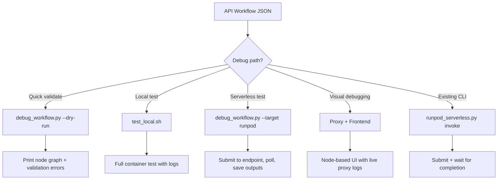
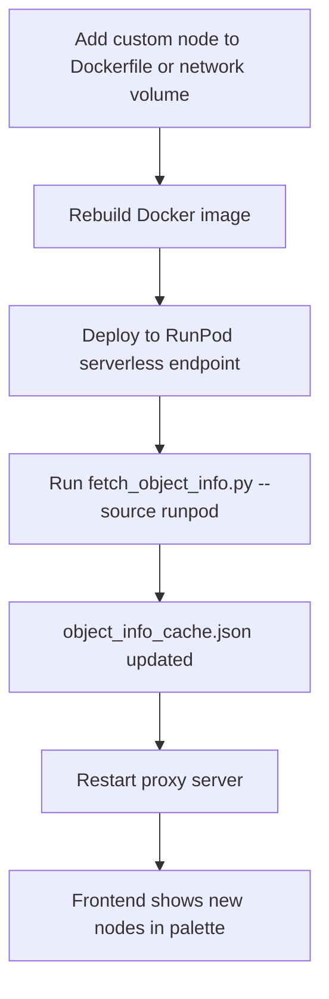

# Plan: Official ComfyUI Frontend with RunPod Serverless Routing

> **Reference:** [ComfyUI Frontend repo](https://github.com/Comfy-Org/ComfyUI_frontend) ·
> [RunPod worker-comfyui](https://hub.docker.com/r/runpod/worker-comfyui) ·
> [Deploying ComfyUI on RunPod Serverless (Medium)](https://medium.com/@ahmadareeb3026/deploying-your-comfyui-workflows-on-the-runpod-serverless-2f0f0a79a8e8)

## Problem Statement

The user wants to run the **official ComfyUI node-based frontend** locally while
routing all GPU processing to a **RunPod Serverless endpoint** — consuming 0 local
VRAM.

### The Protocol Mismatch

This is **not** as simple as setting `DEV_SERVER_COMFYUI_URL` to a RunPod URL.
The two systems speak fundamentally different protocols:

| | ComfyUI Frontend expects | RunPod Serverless provides |
|---|---|---|
| **Protocol** | HTTP REST + WebSocket | HTTP REST (job queue) |
| **Submit** | `POST /prompt` (returns prompt_id) | `POST /v2/{id}/run` (returns job_id) |
| **Status** | WebSocket `/ws` (real-time events) | `GET /v2/{id}/status/{job_id}` (poll) |
| **Results** | `GET /history/{prompt_id}` + `GET /view?filename=...` | `GET /status` returns base64/S3 URLs |
| **Node info** | `GET /object_info` (live from running server) | Not available without a running worker |
| **Uploads** | `POST /upload/image` | Must be embedded in job payload |
| **State** | Stateful (server stays alive between requests) | Stateless (worker dies after each job) |

**Conclusion:** We need a **proxy/adapter server** that translates between these
two protocols.

---

## Architecture

```
┌─────────────────────────────────────────────────────────────┐
│  Local Machine (0 GPU, 0 VRAM)                              │
│                                                             │
│  ┌──────────────┐    Vite dev proxy    ┌─────────────────┐  │
│  │  ComfyUI     │─────────────────────▶│  ComfyUI Proxy  │  │
│  │  Frontend    │  /prompt, /ws, etc.  │  (FastAPI)      │  │
│  │  (Vue.js)    │◀─────────────────────│                 │  │
│  │  :5173       │   REST + WebSocket   │  :8188          │  │
│  └──────────────┘                      └────────┬────────┘  │
│                                                 │            │
└─────────────────────────────────────────────────┼────────────┘
                                                  │ HTTPS
                                          POST /run, GET /status
                                                  ▼
┌─────────────────────────────────────────────────────────────┐
│  RunPod Serverless (scales 0→N on demand)                   │
│                                                             │
│  ┌─────────────────────────────────────────────────────┐    │
│  │  Worker (ghcr.io/alterpeace/runpod-comfy:latest)    │    │
│  │  - ComfyUI + handler.py                             │    │
│  │  - Network volume (models, custom_nodes)            │    │
│  │  - Boots on job → runs workflow → returns output    │    │
│  │  - Shuts down after idle timeout                    │    │
│  └─────────────────────────────────────────────────────┘    │
└─────────────────────────────────────────────────────────────┘
```

### Components

1. **ComfyUI Frontend** (`frontend/`) — cloned from
   `https://github.com/Comfy-Org/ComfyUI_frontend`. Runs via `npm run dev`
   on port 5173. The Vite dev server proxies API calls to the proxy server.

2. **ComfyUI Proxy Server** (`src/proxy_server.py`) — a FastAPI app on port
   8188 that implements the subset of ComfyUI REST + WebSocket API the frontend
   needs, translating each call to RunPod Serverless API calls.

3. **Object Info Cache** (`config/object_info_cache.json`) — a snapshot of
   `GET /object_info` from a running ComfyUI instance. The proxy serves this
   to the frontend so the node palette renders without a live ComfyUI server.
   Refreshed on-demand via a script.

4. **Environment config** (`.env`) — RunPod API key, endpoint ID, proxy port,
   object_info cache path.

---

## Proxy Server Design (`src/proxy_server.py`)

The proxy must implement these ComfyUI API endpoints:

### REST Endpoints

| Endpoint | Method | Proxy Behavior |
|---|---|---|
| `/object_info` | GET | Serve cached `object_info_cache.json`. If missing, cold-start a worker and fetch. |
| `/object_info/{node}` | GET | Filter from cache. |
| `/system_stats` | GET | Return synthetic stats (GPU info from config, fake VRAM). |
| `/prompt` | POST | Translate workflow JSON → RunPod `POST /run`, store job_id↔prompt_id mapping, return `{"prompt_id": ...}`. |
| `/history/{prompt_id}` | GET | Poll RunPod `GET /status/{job_id}`, return ComfyUI history format. |
| `/history` | GET | Return all completed jobs. |
| `/view` | GET | Fetch image from RunPod output (base64 decode or S3 URL proxy). |
| `/upload/image` | POST | Store locally, return ComfyUI upload response format. Include in next job payload. |
| `/queue` | GET | Return synthetic queue (pending RunPod jobs). |
| `/queue` | POST | Forward cancel to RunPod `POST /cancel/{job_id}`. |
| `/api/userdata` | GET | Return empty/synthetic user data. |
| `/api/extensions` | GET | Return empty extensions list. |

### WebSocket Endpoint

| Endpoint | Proxy Behavior |
|---|---|
| `/ws` | Accept WebSocket connection. When a `/prompt` job is submitted, spawn a background poller that emits synthetic `execution_start`, `execution_cached`, `executing`, `executed`, `execution_success` events by polling RunPod status. |

### WebSocket Event Simulation

The frontend listens for these WebSocket message types during execution:

```json
// 1. Job submitted
{"type": "execution_start", "data": {"prompt_id": "uuid"}}

// 2. (optional) Cache hit
{"type": "execution_cached", "data": {"prompt_id": "uuid", "nodes": []}}

// 3. Node executing
{"type": "executing", "data": {"prompt_id": "uuid", "node": "6"}}

// 4. Node produced output
{"type": "executed", "data": {"prompt_id": "uuid", "node": "9", "output": {"images": [{"filename": "out.png", "type": "output"}]}}}

// 5. Done
{"type": "execution_success", "data": {"prompt_id": "uuid"}}
```

The proxy polls RunPod every 1-2s. While status is `IN_QUEUE` or `IN_PROGRESS`,
it emits `execution_start` + `executing`. When `COMPLETED`, it emits `executed`
+ `execution_success` with the output images mapped to local proxy URLs.

---

## Implementation Steps

### Step 1: Clone the ComfyUI Frontend

```bash
git clone https://github.com/Comfy-Org/ComfyUI_frontend.git frontend
cd frontend
npm install
```

Create `frontend/.env`:
```
DEV_SERVER_COMFYUI_URL=http://127.0.0.1:8188
```

This tells the Vite dev server to proxy all `/api/*`, `/prompt`, `/ws`, etc.
calls to our proxy server on port 8188.

### Step 2: Build the Proxy Server (`src/proxy_server.py`)

FastAPI app with:
- `GET /object_info` — serve cached JSON
- `GET /system_stats` — synthetic stats
- `POST /prompt` — submit to RunPod, return prompt_id
- `GET /history/{prompt_id}` — poll RunPod, translate to ComfyUI format
- `GET /view` — proxy image from RunPod output
- `POST /upload/image` — store locally for inclusion in job payload
- `WebSocket /ws` — real-time event simulation
- Background task: poll RunPod jobs, emit WebSocket events

Dependencies: `fastapi`, `uvicorn`, `websockets`, `httpx`, `aiofiles`

### Step 3: Object Info Cache Script (`scripts/fetch_object_info.py`)

Connects to either:
- A local ComfyUI instance (if running), or
- The RunPod serverless endpoint (cold-starts a worker with a minimal workflow)

Fetches `GET /object_info` and saves to `config/object_info_cache.json`.

Usage:
```bash
python scripts/fetch_object_info.py --source local    # from local ComfyUI
python scripts/fetch_object_info.py --source runpod   # from serverless endpoint
```

### Step 4: Environment Configuration

Add to `.env.example`:
```
# =============================================================================
# COMFYUI FRONTEND PROXY CONFIGURATION
# =============================================================================
# RunPod Serverless endpoint ID for proxy routing
RUNPOD_ENDPOINT_ID=your-endpoint-id

# Proxy server port (must match DEV_SERVER_COMFYUI_URL in frontend/.env)
PROXY_PORT=8188

# Path to cached object_info (for node palette rendering)
OBJECT_INFO_CACHE=config/object_info_cache.json

# Polling interval for RunPod job status (seconds)
PROXY_POLL_INTERVAL=2

# Local storage for uploaded images (img2img workflows)
PROXY_UPLOAD_DIR=./.local/input
```

### Step 5: Helper Scripts

**`scripts/run_frontend.sh`** — one-command startup:
1. Check `frontend/` exists (clone if missing)
2. Check `config/object_info_cache.json` exists (fetch if missing)
3. Start proxy server in background
4. Start ComfyUI Frontend dev server
5. Print URL: `http://localhost:5173`

**`scripts/stop_frontend.sh`** — stop proxy + frontend dev server.

### Step 6: Documentation (`docs/FRONTEND_SETUP.md`)

Covers:
- Architecture overview with diagram
- Prerequisites (Node.js, Python venv)
- Step-by-step setup
- How the proxy translates between protocols
- Refreshing object_info cache when custom nodes change
- Troubleshooting (cold starts, WebSocket disconnects, missing nodes)
- Limitations (no real-time preview, no live model swapping)

---

## Limitations & Trade-offs

| Limitation | Mitigation |
|---|---|
| **Cold start delay** (5-30s per job) | Proxy shows "Queued..." status in WebSocket events |
| **No real-time preview** (serverless returns final output only) | Frontend shows progress as "Executing..." until complete |
| **object_info can go stale** (new custom nodes not reflected) | Re-run `fetch_object_info.py` after adding nodes |
| **No model browsing** (can't list models on serverless) | Proxy returns cached model list or empty |
| **Image uploads need pre-loading** | Proxy stores locally, embeds base64 in job payload |
| **WebSocket is simulated** (not true real-time) | Polling interval configurable (default 2s) |

---

## File Tree (new files)

```
runpod-comfy/
├── frontend/                          # Cloned ComfyUI_frontend (gitignored)
│   └── .env                           # DEV_SERVER_COMFYUI_URL=http://127.0.0.1:8188
├── src/
│   └── proxy_server.py                # FastAPI proxy (NEW)
├── scripts/
│   ├── fetch_object_info.py           # Cache object_info from ComfyUI (NEW)
│   ├── debug_workflow.py              # Standalone workflow debugger (NEW)
│   ├── run_frontend.sh                # Start proxy + frontend (NEW)
│   └── stop_frontend.sh               # Stop proxy + frontend (NEW)
├── config/
│   └── object_info_cache.json         # Cached node definitions (NEW, gitignored)
├── docs/
│   └── FRONTEND_SETUP.md              # Setup guide (NEW)
└── .env.example                       # Updated with proxy config
```

---

## Debugging API Workflows Without the UI

The user also asked about debugging API workflows without the ComfyUI visual
interface. This is a critical workflow for serverless development. We will
provide multiple debugging paths:

### Path 1: CLI Workflow Tester (`scripts/debug_workflow.py`)

A standalone Python script that submits any API-format workflow JSON to either
a local ComfyUI instance or a RunPod serverless endpoint, with verbose output:

```bash
# Test against local ComfyUI (docker-compose up)
python scripts/debug_workflow.py --target local --workflow examples/text_to_image_simple.json

# Test against RunPod serverless endpoint
python scripts/debug_workflow.py --target runpod --workflow examples/text_to_image_simple.json --wait

# Override specific node inputs from CLI
python scripts/debug_workflow.py --target runpod \
  --workflow examples/text_to_image_simple.json \
  --set-input 6.text "a cat sitting on a chair" \
  --set-input 3.seed 999 \
  --set-input 3.steps 30

# Dry-run: validate workflow structure without submitting
python scripts/debug_workflow.py --workflow examples/text_to_image_simple.json --dry-run

# Save output images to disk
python scripts/debug_workflow.py --target runpod --workflow workflow.json --output-dir ./debug-output/
```

Features:
- **Workflow validation** — checks node structure, references, required fields
- **Node graph visualization** — prints a text tree of all nodes and connections
- **Input patching** — override any node input via `--set-input NODE_ID.FIELD VALUE`
- **Verbose logging** — shows every HTTP request/response, timing, status changes
- **Output extraction** — saves base64 images to disk, prints S3 URLs
- **Error formatting** — pretty-prints ComfyUI execution errors with node context
- **Comparison mode** — run same workflow on local + runpod, diff the results

### Path 2: Proxy Server Debug Mode

The proxy server (`src/proxy_server.py`) includes a debug mode that logs all
protocol translations:

```bash
# Start proxy with verbose request/response logging
python src/proxy_server.py --debug

# Logs show:
# [PROXY] POST /prompt → POST https://api.runpod.ai/v2/{id}/run
# [PROXY]   workflow: 8 nodes, seed=42
# [PROXY]   job_id: abc-123, prompt_id: uuid-456
# [PROXY] WS → execution_start {prompt_id: uuid-456}
# [PROXY] Polling status... IN_QUEUE (delay: 3.2s)
# [PROXY] Polling status... IN_PROGRESS (execution: 8.1s)
# [PROXY] WS → executing {prompt_id: uuid-456, node: "3"}
# [PROXY] Polling status... COMPLETED
# [PROXY] WS → executed {prompt_id: uuid-456, node: "9", output: 1 image}
# [PROXY] WS → execution_success {prompt_id: uuid-456}
```

### Path 3: Existing Lifecycle CLI

The project already has [`lifecycle/runpod_serverless.py`](../lifecycle/runpod_serverless.py:200)
with an `invoke` command that can submit workflows and poll for results:

```bash
# Submit and wait
python lifecycle/runpod_serverless.py invoke \
  --endpoint-id YOUR_ENDPOINT_ID \
  --workflow examples/text_to_image_simple.json \
  --wait --timeout 300

# Submit without waiting (get job_id)
python lifecycle/runpod_serverless.py invoke \
  --endpoint-id YOUR_ENDPOINT_ID \
  --workflow examples/text_to_image_simple.json

# Check job status
python lifecycle/runpod_serverless.py status \
  --endpoint-id YOUR_ENDPOINT_ID \
  --job-id JOB_ID
```

### Path 4: Local Docker Test

The existing [`scripts/test_local.sh`](../scripts/test_local.sh:1) spins up the
full container locally and tests the handler end-to-end:

```bash
./scripts/test_local.sh examples/text_to_image_simple.json
```

### Debugging Workflow Summary



---

## Custom Nodes & Models — How They Work with the Frontend

This is a critical question. The frontend's node palette is driven by
`GET /object_info` — a JSON manifest of every available node, its inputs,
outputs, and widget defaults. On a live ComfyUI server, this is generated
dynamically from installed custom nodes and available models.

With the serverless proxy, there is **no live server** between jobs, so we
need a strategy for each.

### Custom Nodes

**Where they live:** Custom nodes are installed on the RunPod serverless
worker's Docker image (baked in at build time) and/or on the network volume
at `/runpod-volume/custom_nodes/`. See
[`Dockerfile`](../Dockerfile:1) and
[`scripts/update_custom_nodes.sh`](../scripts/update_custom_nodes.sh:1).

**How the frontend knows about them:** The proxy serves a cached
`object_info` snapshot. When you add or update custom nodes on the serverless
image, you must refresh this cache:

```bash
# Refresh from a local Docker ComfyUI (fastest — if you have the same nodes installed)
python scripts/fetch_object_info.py --source local

# Refresh from the RunPod serverless endpoint (cold-starts a worker)
python scripts/fetch_object_info.py --source runpod --endpoint-id YOUR_ID
```

This fetches `GET /object_info` from a running ComfyUI and saves it to
[`config/object_info_cache.json`](../config/object_info_cache.json:1). The
proxy serves this to the frontend so the node palette renders correctly.

**Workflow for adding a new custom node:**



### Models

**Where they live:** Models are stored on the RunPod network volume at
`/runpod-volume/models/` (checkpoints, LoRAs, VAEs, etc.). See
[`docs/SERVERLESS_DEPLOY.md`](../docs/SERVERLESS_DEPLOY.md:58) Step 1.

**How the frontend knows about them:** ComfyUI's `object_info` includes
model dropdown widgets that list available files. The cached snapshot
includes whatever models were present when `fetch_object_info.py` was run.

**Problem:** If you add a new model to the network volume, the cached
`object_info` won't list it until you refresh.

**Solution — Model List Refresh Script:**

`scripts/fetch_object_info.py` will also support a `--models-only` flag that
scans the network volume (via SSH or RunPod API) and patches the model lists
in the existing cache without a full re-fetch:

```bash
# Quick refresh of just model lists (no worker cold-start needed)
python scripts/fetch_object_info.py --models-only --volume-id v1abc...
```

This calls the RunPod API to list files on the network volume, then patches
the `ckpt_name`, `lora_name`, `vae_name`, etc. widget lists in
`object_info_cache.json`.

### Debugging Workflows with Custom Nodes

When a workflow references a custom node or model that isn't available on
the serverless worker, the job will fail. The debugging tools handle this:

1. **`debug_workflow.py --dry-run`** — validates that all node `class_type`
   values exist in `object_info_cache.json`. Flags unknown nodes before
   submission.

2. **`debug_workflow.py --validate-models`** — checks that all model files
   referenced in the workflow exist on the network volume (via RunPod API).

3. **Proxy debug mode** — when a job fails, the proxy logs the full error
   from the serverless worker, including which node/model caused the failure.

4. **`debug_workflow.py --compare`** — runs the same workflow on local
   Docker (where you can see the full WebUI) and on RunPod serverless,
   then diffs the results to catch environment differences.

### Summary: Custom Nodes & Models Matrix

| Action | Local Docker | RunPod Serverless | Frontend Impact |
|---|---|---|---|
| Add custom node | `scripts/update_custom_nodes.sh` | Rebuild image or add to volume | Refresh `object_info` cache |
| Add model | Drop in `.local/models/` | Upload to network volume | Refresh model lists in cache |
| Update ComfyUI | Rebuild Docker image | Rebuild + redeploy endpoint | Full `object_info` refresh |
| Debug missing node | Check container logs | `debug_workflow.py --dry-run` | Node shows red in palette |

---

## Testing Strategy

The project already has a comprehensive test suite (12 test files in
[`tests/`](../tests/)). We will add tests for the new proxy server and
debug script, following the existing patterns.

### New Test Files

| File | Tests |
|---|---|
| [`tests/test_proxy_server.py`](../tests/test_proxy_server.py:1) | REST endpoint translation, WebSocket event simulation, RunPod API mocking, object_info caching, image upload handling, error scenarios |
| [`tests/test_debug_workflow.py`](../tests/test_debug_workflow.py:1) | Workflow validation, `--set-input` patching, dry-run mode, local vs runpod target, output extraction, model validation |

### Test Approach

- **Unit tests** with mocked RunPod API responses (using `unittest.mock`)
- **Fixtures** that load example workflows from [`examples/`](../examples/)
- **Async tests** for WebSocket endpoints (using `pytest-asyncio`)
- Follow existing patterns from [`tests/test_handler.py`](../tests/test_handler.py:1)
  and [`tests/test_integration.py`](../tests/test_integration.py:1)

### Running Tests

```bash
# Run all tests (existing + new)
uv run pytest

# Run only proxy tests
uv run pytest tests/test_proxy_server.py -v

# Run only debug workflow tests
uv run pytest tests/test_debug_workflow.py -v

# Run with coverage
uv run pytest --cov=src/proxy_server --cov=scripts/debug_workflow
```

### Dependencies to Add

Add to [`pyproject.toml`](../pyproject.toml:1) optional `dev` dependencies:
- `fastapi` — for proxy server
- `uvicorn` — ASGI server
- `httpx` — async HTTP client (for RunPod API calls)
- `pytest-asyncio` — async test support
- `websockets` — WebSocket client for testing

---

## Docker & Local Stack — How It All Fits Together

### The Three Ways to Run ComfyUI

The project supports three modes via the `MODE` env var (see
[`entrypoint.sh`](../entrypoint.sh:150)):

| Mode | Command | What Happens | GPU Needed? |
|---|---|---|---|
| **local** | `./scripts/run_local.sh` | Docker container boots ComfyUI with GPU passthrough, WebUI on :8188 | Yes (local GPU) |
| **serverless** | RunPod endpoint | Worker boots on job, runs handler, dies after idle | No (remote GPU) |
| **pods** | `./scripts/run_runpod.sh pods create` | Persistent RunPod GPU pod with WebUI | No (remote GPU) |

### Does `scripts/run_local.sh` Still Work?

**Yes, completely unchanged.** The local Docker stack
([`docker-compose.yml`](../docker-compose.yml:1) +
[`scripts/run_local.sh`](../scripts/run_local.sh:1)) boots a full ComfyUI
instance with GPU passthrough on port 8188. This is **orthogonal** to the
frontend proxy work — the proxy is a separate process that runs alongside
or instead of the local Docker stack.

### How the Pieces Fit Together

```
SCENARIO A: Full local stack (GPU available)
  ./scripts/run_local.sh
    -> Docker container with ComfyUI on :8188 (real GPU)
    -> Open http://localhost:8188 for built-in WebUI
    -> OR run frontend dev server pointing at :8188

SCENARIO B: Frontend + Serverless (no local GPU)
  ./scripts/run_frontend.sh
    -> Proxy server on :8188 (translates to RunPod API)
    -> ComfyUI Frontend dev server on :5173
    -> Open http://localhost:5173 for node-based UI
    -> 0 local VRAM — all processing on RunPod

SCENARIO C: Frontend + Local Docker (GPU available, want new UI)
  ./scripts/run_local.sh          # start ComfyUI in Docker
  ./scripts/run_frontend.sh --local  # frontend points at Docker ComfyUI
    -> Proxy bypassed, frontend talks directly to Docker ComfyUI
    -> Open http://localhost:5173

SCENARIO D: Debug without any UI
  python scripts/debug_workflow.py --target local --workflow examples/text_to_image_simple.json
  python scripts/debug_workflow.py --target runpod --workflow examples/text_to_image_simple.json --wait
```

### `run_frontend.sh` Design

The script auto-detects which backend to use:

```bash
# Auto-detect: if local ComfyUI is running on :8188, use it directly
# Otherwise, start the proxy server to translate to RunPod API
./scripts/run_frontend.sh

# Force serverless proxy mode
./scripts/run_frontend.sh --serverless

# Force local mode (requires Docker ComfyUI running)
./scripts/run_frontend.sh --local
```

---

## Execution Order

1. Add proxy + test dependencies to [`pyproject.toml`](../pyproject.toml:1)
2. Add proxy config to [`.env.example`](../.env.example:1) and `.env`
3. Build `src/proxy_server.py` (FastAPI + WebSocket)
4. Build `scripts/fetch_object_info.py` (with `--models-only` support)
5. Build `scripts/debug_workflow.py` (standalone workflow debugger)
6. Build `scripts/run_frontend.sh` + `scripts/stop_frontend.sh`
7. Write `tests/test_proxy_server.py` + `tests/test_debug_workflow.py`
8. Write `docs/FRONTEND_SETUP.md`
9. Update `.gitignore` for `frontend/` and `object_info_cache.json`
10. Run `uv run pytest` to verify all tests pass
11. Test: start proxy, start frontend, submit a test workflow
12. Test: `debug_workflow.py` against local + runpod targets
