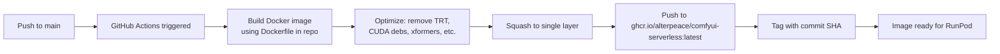

# Plan: GitHub Actions CI to Build & Push Image to ghcr.io

## Problem
The 19.5 GB Docker image takes ~16-19 h to push from the local machine through a Mullvad VPN (~280 KB/s). Even with occasional speedups, the link is unreliable and drops kill the single squashed blob.

## Solution
Use **GitHub Actions** to build the image in CI and push directly to ghcr.io. GitHub's runners have ~10 Gbps network to ghcr.io, so the push completes in minutes, not hours.

## Architecture



## Key Design Decisions

### 1. Runner Type: `ubuntu-22.04` (standard runner)
- The Dockerfile's base image (`nvidia/cuda:12.9.0-devel`) includes CUDA toolkit — no GPU runner needed for the build itself
- SageAttention/FlashAttention compile from source using the CUDA devel image; they don't need a physical GPU to compile
- Standard runners have 4 CPU, 16 GB RAM, 14 GB temp — enough for the build (MAX_JOBS=2)
- **If the build OOMs on a standard runner**, upgrade to `ubuntu-22.04-4cores-16gb` or use a larger runner

### 2. Build Strategy: Multi-stage with cache
- Use `docker/build-push-action` with GitHub Actions cache (`type=gha`)
- The base stage (PyTorch + CUDA) rarely changes → cached after first build
- Subsequent builds only rebuild changed layers (deps, runtime, final)
- **Do NOT squash in CI** — keep multi-layer for better caching across builds. The size difference (19.5 vs ~24 GB) is worth the caching benefit

### 3. Optimization as Build Args (not post-build surgery)
Instead of the manual `Dockerfile.slim2` approach, add build args to the main Dockerfile:
- `ENABLE_TENSORRT=false` (skip TensorRT install — saves 6.2 GB)
- `ENABLE_XFORMERS=false` (skip broken xformers — saves 993 MB)
- `ENABLE_FLASHATTENTION=false` (already off in compose)
- Post-build cleanup of system CUDA debs + GTK in the Dockerfile itself (new final stage)

### 4. Triggers
- `push` to `main` → build + push `:latest` + `:sha`
- `tag` (e.g. `v1.0.0`) → build + push `:v1.0.0` + `:latest`
- `workflow_dispatch` → manual trigger from GitHub UI

### 5. Authentication
- `GITHUB_TOKEN` is automatically available in Actions — no manual token needed
- Use `packages: write` permission in the workflow YAML
- The package inherits visibility from the repo (public repo → public package)

## Workflow File

```yaml
# .github/workflows/build-and-push.yml
name: Build and Push Image

on:
  push:
    branches: [main]
  workflow_dispatch:

env:
  REGISTRY: ghcr.io
  IMAGE_NAME: ${{ github.repository }}

jobs:
  build-and-push:
    runs-on: ubuntu-22.04
    permissions:
      contents: read
      packages: write

    steps:
      - name: Checkout
        uses: actions/checkout@v4

      - name: Set up Docker Buildx
        uses: docker/setup-buildx-action@v3

      - name: Log in to ghcr.io
        uses: docker/login-action@v3
        with:
          registry: ${{ env.REGISTRY }}
          username: ${{ github.actor }}
          password: ${{ secrets.GITHUB_TOKEN }}

      - name: Extract metadata
        id: meta
        uses: docker/metadata-action@v5
        with:
          images: ${{ env.REGISTRY }}/${{ env.IMAGE_NAME }}
          tags: |
            type=raw,value=latest
            type=sha,prefix=,format=short

      - name: Build and push
        uses: docker/build-push-action@v6
        with:
          context: .
          file: ./Dockerfile
          push: true
          tags: ${{ steps.meta.outputs.tags }}
          labels: ${{ steps.meta.outputs.labels }}
          cache-from: type=gha
          cache-to: type=gha,mode=max
          build-args: |
            ENABLE_TENSORRT=false
            ENABLE_XFORMERS=false
            ENABLE_FLASHATTENTION=false
            ENABLE_SAGEATTENTION=true
            COMFYUI_VERSION=v0.27.0
            TORCH_VERSION=2.10.0
            TORCH_FLAVOR=cu129
```

## Dockerfile Changes Needed

Add `ENABLE_TENSORRT` build arg to gate the TensorRT install lines (currently lines 328-331 and 129):

```dockerfile
# Add to ARG section:
ARG ENABLE_TENSORRT=false

# Gate the TensorRT installs:
RUN --mount=type=cache,target=/cache/uv,sharing=locked \
    if [ "${ENABLE_TENSORRT}" = "true" ]; then \
        . venv/bin/activate && \
        uv pip install tensorrt tensorrt-cu12 --extra-index-url https://pypi.nvidia.com; \
    fi
```

Add a final cleanup stage that removes system CUDA debs + build toolchain:

```dockerfile
# In the runtime stage, after all installs:
RUN dpkg-query -W --showformat='${Package}\n' | \
      grep -iE "cuda|nccl|npp|cublas|cusparse|cusolver|cufft|curand|nvjitlink|cupti|nvrtc" | \
      xargs apt-get purge -y --allow-change-held-packages && \
    apt-get autoremove -y && \
    rm -rf /usr/local/cuda-12.9 /usr/local/cuda /var/lib/apt/lists/*
```

## Concerns & Mitigations

| Concern | Mitigation |
|---|---|
| Build takes 1-2 h (SageAttention compiles from source) | GitHub Actions has 6 h timeout on standard runners; cache makes rebuilds fast |
| Image is ~20 GB — exceeds GitHub Actions disk (14 GB temp) | Use `docker/build-push-action` which streams layers to ghcr without storing full image on disk |
| Standard runner has no GPU — can't test image | CI builds + pushes only; testing happens locally or on RunPod after pull |
| First build has no cache → slow | Subsequent builds use `cache-from: type=gha` — only changed layers rebuild |
| ghcr.io free tier storage limit | GitHub Pro includes 500 MB packages; the image is ~20 GB. May need to check if the account has enough storage. Alternative: use Docker Hub |

## Steps to Implement

1. Add `ENABLE_TENSORRT` build arg to [`Dockerfile`](Dockerfile:1) (gate the TRT install lines)
2. Add system CUDA deb cleanup to the Dockerfile's runtime stage
3. Create `.github/workflows/build-and-push.yml`
4. Push to `main` → GitHub Actions builds and pushes automatically
5. Make the package public on GitHub
6. Reference `ghcr.io/alterpeace/runpod-comfy:latest` in RunPod

## Alternative: GitHub Actions with Larger Runner
If the standard runner can't handle the build (OOM during SageAttention compilation), use a larger runner:
- `runs-on: ubuntu-22.04-4cores-16gb` (free for public repos)
- Or `runs-on: ubuntu-latest-16-cores` (requires GitHub Team/Enterprise)
