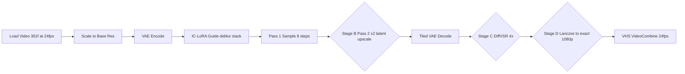

# LTX 2.3 V2V AnimateDiff Cleanup Workflows (8GB + 24GB)

## Overview

Two new example workflows for re-detailing / cleaning up ~15s AnimateDiff renders
(24fps, 1080p source): remove undescribable detail, fix blur, smooth jittery motion.
Every post-processing stage is **bypassable** so output can be tested at any tier.

- **`examples/ltx23_v2v_animatediff_cleanup_8gb.json`** — RTX 2070 SUPER (8GB) local
- **`examples/ltx23_v2v_animatediff_cleanup_24gb.json`** — RTX 4090 (24GB) RunPod

Each ships in API format (serverless handler) and UI format (`*_ui.json`, grouped
bypassable stages) — matching the `ltx23_v2v_music_visuals_patch*` precedent.

## Pipeline

- Stage B exists only in the 24GB workflow (latent upscaler too VRAM-heavy for 8GB).
- Stages B–D bypassable: UI format = right-click group bypass (auto-reroute);
  API format = documented one-line rewire per stage in the README.
- Output stays at 24fps end-to-end (matches source). No frame interpolation —
  per user decision, 2026-08-08.
- 15s @ 24fps = 361 frames (8n+1 rule) — fits the ~385-frame single-pass ceiling,
  no segment chaining needed.

## 8GB Workflow (local)

- `UnetLoaderGGUF` → `ltx-2.3-22b-distilled-1.1-Q4_K_M.gguf` (distilled baked in)
- Text encoder on `device: cpu`; `use_tiled_encode: true`; tiled decode 2×2
- LoRAs: `iclora_deblur` (0.6, gated) + `omninft_rl_lora` (2.0)
- Base res 512×288, 361 frames, single pass (8 steps, linear_quadratic, euler, cfg 1.0)

| Mode | DiffVSR 4x | Lanczos 1080p | Output |
|---|---|---|---|
| Preview | OFF | OFF | 512×288 @ 24fps |
| ~2K | ON | OFF | 2048×1152 @ 24fps |
| 1080p | ON | ON | 1920×1080 @ 24fps |

- DiffVSR settings: fp16, chunk_size 4 (8 if it fits), inference_steps 4, guidance 0
- Optional brave base-res step-up: 640×352 → DiffVSR → 2560×1408

## 24GB Workflow (RunPod)

- `CheckpointLoaderSimple` → `ltx-2.3-22b-dev.safetensors`
- LoRAs: `distilled_lora` (1.0) + `iclora_deblur` (0.6) + `iclora_decompression` (0.7)
  + `omninft_rl_lora` (2.0)
- Default base res 768×432 (proven config), 361 frames
- Pass 2: `LTXVLatentUpsampler` ×2 + `ManualSigmas` 0.85, 0.725, 0.4219, 0.0

| Mode | Base res | Pass 2 | DiffVSR 4x | Output |
|---|---|---|---|---|
| Preview | 768×432 | OFF | OFF | 768×432 |
| Default | 768×432 | ON | OFF | 1536×864 |
| 3K | 768×432 | OFF | ON | 3072×1728 |
| 1080p exact | 960×544 | ON | OFF | 1920×1088 |
| 4K | 960×544 | OFF | ON | 3840×2176 |

- 960×544 is the documented brave variant (pass-2 at 361f there risks OOM;
  mitigations: tiled encode on, 2×2 decode tiles, `--lowvram`, or 241-frame cap).
- Never run Pass 2 + DiffVSR together (6144×3456 — pointless).

## Frame rate decision

Output stays at 24fps everywhere (user decision). No frame-interpolation stage,
no VFI node pack dependency. If 48/60fps is ever wanted later:
`comfyui-frame-interpolation` (RIFE 2x → 48fps) is the add-on, with
`VHS_VideoCombine` `frame_rate` edited to match.

## Dependencies to add

- `scripts/add-dependancies.sh`: clone
  `https://github.com/filliptm/ComfyUI-FL-DiffVSR.git`
  (API-format graphs reference its node classes, so the pack must exist in the
  image even when the stage is bypassed/dormant).
- `config/ltx-2.3-models.json`: investigate `Jamichsu/Stream-DiffVSR` HF layout
  (~2GB, node auto-downloads to `models/stream_diffvsr/`). Add manifest entries if
  file layout allows; otherwise document auto-download + B2/network-volume caching
  to avoid serverless cold-start downloads.
- Gated LoRAs (`iclora_deblur`, `iclora_decompression`): user handles HF agree +
  `HF_TOKEN`; README documents the steps (same as existing decompression docs).
- Verify xformers availability in image; set `enable_xformers` accordingly
  (default false if absent, to avoid loader crash).

## Files

1. `examples/ltx23_v2v_animatediff_cleanup_8gb.json` (API)
2. `examples/ltx23_v2v_animatediff_cleanup_8gb_ui.json` (UI, grouped stages)
3. `examples/ltx23_v2v_animatediff_cleanup_24gb.json` (API)
4. `examples/ltx23_v2v_animatediff_cleanup_24gb_ui.json` (UI, grouped stages)
5. `examples/ltx23_v2v_animatediff_cleanup_README.md` (mode tables, stage-toggle
   JSON patches, HF gating, VRAM fallbacks, RunPod usage)
6. `examples/README.md` — add entries for both workflows

## Validation

- JSON lint all four workflow files
- Cross-check every `class_type` against local ComfyUI `/object_info`
- Optional smoke test: `./scripts/test_local.sh examples/ltx23_v2v_animatediff_cleanup_8gb.json`
  with a short clip (lower frame_load_cap for the test)
