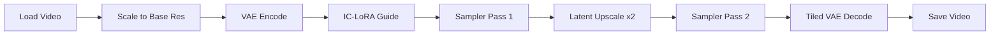

# LTX 2.3 V2V IC-LoRA Detailer + Upscale Workflow Plan

## Overview

Two workflows for video-to-video (V2V) with IC-LoRA detailing and spatial upscaling:

1. **`ltx23_v2v_iclora_detail_upscale_24gb.json`** — Full quality for RTX 4090 (24GB) on RunPod
2. **`ltx23_v2v_iclora_detail_8gb.json`** — Reduced quality for RTX 2070 SUPER (8GB) local dev

## Architecture

### Pass 1: Base Generation (IC-LoRA V2V)
- Load input video → scale to base resolution
- VAEEncode to latent space
- `LTXAddVideoICLoRAGuide` with IC-LoRA(s) for detailing/restyling
- `SamplerCustomAdvanced` with `RandomNoise` + `CFGGuider`
- `BasicScheduler` with `linear_quadratic`, 8 steps, `denoise=1.0`
- `KSamplerSelect` with `euler` sampler

### Pass 2: Spatial Upscale (Detail Enhancement)
- `LTXVLatentUpsampler` ×2 (doubles latent resolution)
- `ManualSigmas` with `0.85, 0.725, 0.4219, 0.0` (official Lightricks Pass 2 sigmas)
- `SamplerCustomAdvanced` with same noise/guider/sampler
- Low denoise (0.85 start) preserves structure while adding detail

### Output
- `LTXVTiledVAEDecode` (tiled to manage VRAM)
- `VHS_VideoCombine` → H.264 MP4

## 24GB RTX 4090 Workflow (RunPod)

### Models
- **Checkpoint**: `ltx-2.3-22b-dev.safetensors` (BF16, ~44GB) — full quality
  - OR GGUF Q8 (`ltx-2.3-22b-distilled-1.1-Q8_0.gguf`) if BF16 is too slow
- **Text Encoder**: `gemma_3_12B_it_fp4_mixed.safetensors`
- **VAE**: `ltx-2.3-22b-dev_video_vae.safetensors`
- **Distilled LoRA**: `ltx-2.3-22b-distilled-lora-384-1.1.safetensors` (speed)
- **IC-LoRA**: `ltx-2.3-22b-ic-lora-decompression-0.9.safetensors` (detailing)
- **OmniNFT RL LoRA**: `LTX-2.3-OmniNFT-RL-Lora_bf16.safetensors` (quality boost, strength 2.0)
- **Spatial Upscaler**: `ltx-2.3-spatial-upscaler-x2-1.1.safetensors` (needs download)

### Parameters
- Base resolution: 768×432 (16:9) or 640×640 (square)
- Frame count: 193 (~8s at 24fps)
- Pass 1: 8 steps, `linear_quadratic`, `denoise=1.0`, `cfg=1.0`
- Pass 2: 3 steps, `ManualSigmas` `0.85, 0.725, 0.4219, 0.0`, `cfg=1.0`
- Final output: ~1536×864 (after ×2 upscale)

### Node Chain
1. `CheckpointLoaderSimple` → `ltx-2.3-22b-dev.safetensors`
2. `CLIPLoader` → `gemma_3_12B_it_fp4_mixed.safetensors`, type=`ltxv`
3. `VAELoader` → `ltx-2.3-22b-dev_video_vae.safetensors`
4. `LoraLoader` → distilled LoRA (strength 1.0)
5. `LTXICLoRALoaderModelOnly` → decompression IC-LoRA (strength_model 0.7)
6. `LTXICLoRALoaderModelOnly` → OmniNFT RL LoRA (strength_model 2.0)
7. `CLIPTextEncode` × 2 (positive/negative)
8. `VHS_LoadVideo` → input video
9. `ImageScale` → 768×432
10. `VAEEncode` → latent
11. `LTXAddVideoICLoRAGuide` → IC-LoRA conditioning
12. `BasicScheduler` → 8 steps, linear_quadratic
13. `KSamplerSelect` → euler
14. `RandomNoise` → seed
15. `CFGGuider` → model + conditioning
16. `SamplerCustomAdvanced` → Pass 1
17. `LTXVLatentUpsampler` → ×2 spatial
18. `ManualSigmas` → `0.85, 0.725, 0.4219, 0.0`
19. `KSamplerSelect` → euler (Pass 2)
20. `SamplerCustomAdvanced` → Pass 2
21. `LTXVTiledVAEDecode` → tiled decode
22. `VHS_VideoCombine` → output MP4

## 8GB RTX 2070 SUPER Workflow (Local)

### Key Differences from 24GB
- **Checkpoint**: `UnetLoaderGGUF` → `ltx-2.3-22b-distilled-1.1-Q4_K_M.gguf` (Q4 quantized, ~14GB)
- **No spatial upscaler pass** — too VRAM-intensive for 8GB
- **No Pass 2** — single pass only
- **Lower resolution**: 512×288 (fits 8GB with `--lowvram`)
- **Fewer frames**: 97 (~4s at 24fps)
- **Tiled VAE decode**: `horizontal_tiles=2, vertical_tiles=2` (more aggressive tiling)
- **IC-LoRA**: Only OmniNFT RL LoRA (skip decompression to save VRAM)
- **No distilled LoRA** — already baked into the distilled GGUF

### Parameters
- Base resolution: 512×288
- Frame count: 97 (~4s at 24fps)
- Single pass: 8 steps, `linear_quadratic`, `denoise=1.0`, `cfg=1.0`
- Tiled VAE: 2×2 tiles, overlap=2

## Models to Download

### For 24GB workflow (need to download)
- `ltx-2.3-spatial-upscaler-x2-1.1.safetensors` → `latent_upscale_models/`
  - Repo: `Lightricks/LTX-2.3`
  - Already in manifest as `spatial_upscaler`

### Already downloaded
- GGUF Q4, text encoder, distilled LoRA, decompression IC-LoRA, OmniNFT RL LoRA, video VAE

## Dual-Purpose Considerations

The workflows share the same node structure but differ in:
1. **Loader**: `CheckpointLoaderSimple` (24GB) vs `UnetLoaderGGUF` (8GB)
2. **Resolution**: 768×432 (24GB) vs 512×288 (8GB)
3. **Pass 2**: Present (24GB) vs absent (8GB)
4. **Tiling**: 1×1 (24GB) vs 2×2 (8GB)
5. **LoRA stack**: Full (24GB) vs minimal (8GB)

Making them truly "dual-purpose" (one workflow with env-based switching) isn't practical in ComfyUI — the node graph structure differs (Pass 2 exists/doesn't exist). Two separate workflow files is the clean approach.

## Implementation Steps

1. Download `ltx-2.3-spatial-upscaler-x2-1.1.safetensors` to container
2. Create `examples/ltx23_v2v_iclora_detail_upscale_24gb.json`
3. Create `examples/ltx23_v2v_iclora_detail_8gb.json` (simplified, no upscale pass)
4. Validate both via ComfyUI API
5. Upload spatial upscaler to RunPod S3
6. Update `examples/README.md` with workflow descriptions
