# Pre-Flight Test Suite for LTX-2.5 Workflows

## Problem Summary

We discovered **5 categories of failures** when running LTX-2.5 V2V workflows on RunPod:

1. **Wrong node names** — Workflows used `LTXVLatentUpscaler` but ComfyUI core has `LTXVLatentUpsampler` (with "r"). Also `LTXVLatentUpscalerLoader` and `LTXVLatentUpscale` don't exist — replaced by `LatentUpscaleModelLoader` + `LTXVLatentUpsampler`.

2. **ComfyUI API changes** — `SamplerCustomAdvanced` in ComfyUI v0.27.0 requires `noise` (NOISE) + `guider` (GUIDER) inputs instead of `model`/`positive`/`negative`. Also `LTXICLoRALoaderModelOnly` uses `strength_model` not `strength`, `VHS_LoadVideo` requires `custom_width`/`custom_height`, and `LTXVImgToVideoConditionOnly` was replaced by `LTXVImgToVideo` (different outputs).

3. **Missing tokenizer** — The int8-convrot text encoder safetensors doesn't contain the SentencePiece tokenizer data. `CLIPLoader` with `type: "ltxv"` fails with "invalid tokenizer". Must use `LTXVGemmaCLIPModelLoader` which loads from a directory with `config.json`, `tokenizer.model`, etc.

4. **Corrupted checkpoint** — The `ltx-2.5-22b-dev-transformer-comfy-int8-convrot.safetensors` on the RunPod volume was corrupted (shape mismatch / buffer length error). Re-downloading with `--force` fixed it.

5. **Missing tokenizer directory on RunPod volume** — The `gemma4-12b-ltx-2.5/` directory with config/tokenizer files exists locally but not on the RunPod volume. The volume only has flat files.

## Architecture

```mermaid
graph TD
    subgraph "Pre-Flight Test Suite"
        A[test_preflight.py] --> B[1. Workflow Structure Validation]
        A --> C[2. Node Type Validation]
        A --> D[3. Model File Integrity]
        A --> E[4. Config/Tokenizer Files]
        A --> F[5. Custom Node Check]
        A --> G[6. Dry-Run Submission]
        A --> H[7. RunPod Volume Health]
    end

    B --> B1[Parse JSON]
    B --> B2[Check node refs]
    B --> B3[Check outputs exist]

    C --> C1[Fetch object_info]
    C --> C2[Compare node types]
    C --> C3[Check required inputs]

    D --> D1[Check file exists]
    D --> D2[Check file size > 0]
    D --> D3[Check safetensors header]

    E --> E1[Check config.json]
    E --> E2[Check tokenizer.model]
    E --> E3[Check tokenizer_config.json]

    F --> F1[Check custom_nodes dir]
    F --> F2[Check importable]

    G --> G1[POST /prompt to ComfyUI]
    G --> G2[Check 200 response]

    H --> H1[SSH or API to volume]
    H --> H2[Check model files]
    H --> H3[Check custom_nodes]
```



## Test Levels

### Level 1: Static Validation (no ComfyUI needed)
- **Workflow structure** — JSON is valid, all node references resolve, at least one output node
- **Model file references** — All `ckpt_name`, `clip_name`, `lora_name`, `vae_name`, `model_name` values are non-empty strings
- **Can run anywhere** — No GPU, no ComfyUI, no Docker needed

### Level 2: Node Type Validation (needs object_info cache)
- **Fetch object_info** from local ComfyUI or RunPod endpoint
- **Check every `class_type`** in each workflow exists in object_info
- **Check required inputs** — Every required input in object_info is present in the workflow node
- **Check input types match** — e.g. if object_info says `gemma_path` is a COMBO with specific options, verify the workflow value is in that list

### Level 3: Model File Integrity (needs filesystem access)
- **Check file exists** — For each model referenced in workflows, check the file exists on disk
- **Check file size > 0** — Catch truncated/incomplete downloads
- **Check safetensors header** — Read the first 8 bytes (header length) + header JSON to verify the file is a valid safetensors file with expected tensor count
- **Check config/tokenizer files** — For directory-format models (e.g. `gemma4-12b-ltx-2.5/`), verify `config.json`, `tokenizer.model`, `tokenizer_config.json` exist

### Level 4: Custom Node Check (needs ComfyUI install)
- **Check custom_nodes directory** — Verify expected custom nodes are installed
- **Check importable** — Try importing each custom node module
- **Check node registry** — Verify the nodes appear in object_info

### Level 5: Dry-Run Submission (needs running ComfyUI)
- **POST /prompt** — Submit the workflow to ComfyUI's `/prompt` endpoint
- **Check 200 response** — If ComfyUI accepts it, the workflow is valid
- **Check 400 response** — Parse error details and report which nodes/inputs failed
- **Does NOT execute** — ComfyUI validates but doesn't run (we cancel immediately)

### Level 6: RunPod Volume Health (needs RunPod API)
- **List model files** on the volume via SSH or API
- **Check checksums/sizes** of critical model files
- **Check custom_nodes** are installed on the volume
- **Check input files** exist (e.g. `rhizome.mp4`)
- **Check tokenizer directory** has all required files

## Implementation Plan

### File: `tests/test_preflight.py`

A pytest module with tests organized by level. Each level can be run independently:

```bash
# Level 1 only (static, no dependencies)
uv run pytest tests/test_preflight.py -k "static"

# Level 2 (needs object_info cache)
uv run pytest tests/test_preflight.py -k "node_types"

# Level 3 (needs local models dir)
uv run pytest tests/test_preflight.py -k "models"

# Level 4 (needs ComfyUI install)
uv run pytest tests/test_preflight.py -k "custom_nodes"

# Level 5 (needs running ComfyUI)
uv run pytest tests/test_preflight.py -k "dry_run"

# Level 6 (needs RunPod API)
uv run pytest tests/test_preflight.py -k "runpod"

# All levels
uv run pytest tests/test_preflight.py
```

### File: `scripts/preflight_check.py`

A standalone CLI script that runs all checks and prints a report:

```bash
# Check local ComfyUI
uv run python scripts/preflight_check.py --target local

# Check RunPod endpoint
uv run python scripts/preflight_check.py --target runpod --endpoint-id taea2mhlwbdkuq

# Check specific workflows only
uv run python scripts/preflight_check.py --workflows examples/ltx25_v2v_redetail_24gb.json

# Check model files only (no ComfyUI needed)
uv run python scripts/preflight_check.py --models-only
```

## Key Design Decisions

1. **Safetensors integrity check** — Read the first 8 bytes as a little-endian uint64 (header length), then read that many bytes as JSON. Verify it parses and has a `__metadata__` key or at least one tensor entry. This catches corruption without loading the full file.

2. **object_info as source of truth** — The ComfyUI `/object_info` endpoint tells us exactly what nodes exist and what inputs they require. We compare workflows against this, not against hardcoded expectations.

3. **Two execution modes** — Local (direct filesystem + HTTP to ComfyUI) and RunPod (API calls to serverless endpoint). The RunPod mode can check volume health via the `download_models` handler action with `--dry-run`.

4. **Graceful degradation** — Each test level skips gracefully if its dependencies aren't available (no ComfyUI running, no RunPod API key, etc.) rather than failing.

5. **Report format** — Clear pass/fail per check with actionable error messages (e.g. "Node 'LTXVLatentUpscaler' not found — did you mean 'LTXVLatentUpsampler'?").
