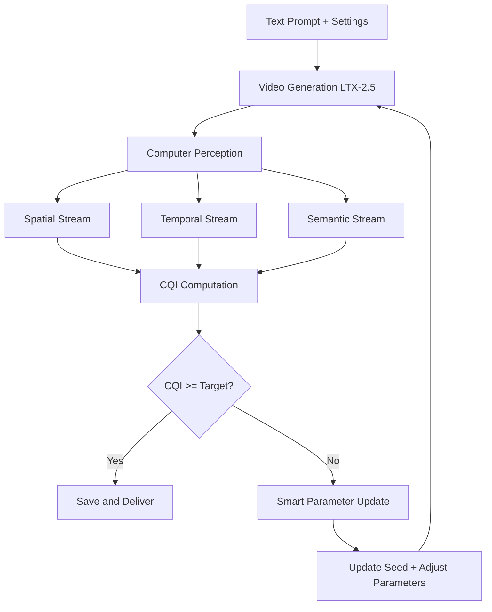

# Automated Video Quality Feedback Loop — Architecture & Implementation Plan

## Overview

An automated system that generates video, evaluates its quality using computer perception, and iteratively regenerates until quality targets are met. This creates a self-improving pipeline for LTX-2.5 video generation on RunPod serverless.

---

## Step 1: Perception — How the Computer Watches Video

The system breaks video into three parallel analysis streams:

### Spatial Stream (Per-Frame Analysis)
- **DINOv2** — Self-supervised vision transformer for feature extraction
  - Inspects individual frames for sharpness, blur, structural coherence
  - Outputs: per-frame feature embeddings (768-dim)
- **CLIP** — Vision-language model for semantic understanding
  - Evaluates lighting balance, color grading, composition
  - Outputs: image embeddings (512-dim) + text-image similarity
- **ResNet** — Classic CNN for artifact detection
  - Detects compression artifacts, banding, noise patterns
  - Outputs: artifact probability scores

### Temporal Stream (Motion Analysis)
- **RAFT** — Optical flow estimation
  - Analyzes motion smoothness between consecutive frames
  - Detects camera movement patterns, flickering, frame jitter
  - Outputs: flow magnitude + direction per frame pair
- **Frame-to-Frame Feature Distance**
  - LPIPS (Learned Perceptual Image Patch Similarity) between consecutive frames
  - Detects sudden jumps, morphing, temporal inconsistency
  - Outputs: LPIPS variance across all frame pairs

### Semantic/Identity Stream (Subject Tracking)
- **ArcFace** — Face recognition embeddings
  - Monitors if main subject maintains appearance from frame 0 to final frame
  - Outputs: cosine distance between first-frame and current-frame face embeddings
  - Score > 0.85 = identity preserved, < 0.60 = morphing detected
- **CoTracker** — Object/point tracking
  - Tracks key points across frames for structural consistency
  - Outputs: trajectory smoothness + point persistence scores

---

## Step 2: Judgment — How the Computer Scores Quality

### Scoring Modules

| Module | Model | Score Range | Weight | What It Measures |
|---|---|---|---|---|
| Technical Quality | DOVER / Fast-VQA | 0-1 | 0.25 | Blur, artifacts, compression, lighting |
| Aesthetic Quality | DOVER / Fast-VQA | 0-1 | 0.20 | Composition, color harmony, visual appeal |
| Temporal Consistency | LPIPS Variance + Optical Flow | 0-1 | 0.20 | Flicker, jitter, motion smoothness |
| Identity Consistency | DINOv2 / ArcFace Cosine | 0-1 | 0.15 | Subject preservation across frames |
| Prompt Alignment | CLIP-Score / ViCLIP | 0-1 | 0.15 | Text-to-video semantic match |
| VLM Critic | Qwen2-VL / GPT-4o | 1-10 | 0.05 | Visual bugs, overall quality judgment |

### Composite Quality Index (CQI)

```python
CQI = (
    technical_score * 0.25 +
    aesthetic_score * 0.20 +
    temporal_score * 0.20 +
    identity_score * 0.15 +
    prompt_score * 0.15 +
    vlm_score_normalized * 0.05
)
# CQI range: 0.0 (terrible) to 1.0 (perfect)
# Target threshold: 0.75 for production, 0.85 for premium
```

---

## Step 3: Decision Gate and Feedback Loop



### Decision Logic

1. Generate video with current parameters
2. Run all three perception streams in parallel
3. Compute weighted CQI
4. If CQI >= target threshold → save and deliver
5. If CQI < target → analyze which scores failed, update parameters, retry
6. Maximum retries: 3 (to control cost)

---

## Step 4: Python Architecture Blueprint

```python
"""
Automated Video Quality Feedback Loop
Evaluates generated video quality and iteratively regenerates until targets are met.
"""
import torch
import numpy as np
from dataclasses import dataclass, field
from typing import Optional, Dict, List
from pathlib import Path
import cv2
import subprocess
import json
import os

@dataclass
class QualityScores:
    """Container for all quality dimension scores."""
    technical: float = 0.0      # DOVER/Fast-VQA technical
    aesthetic: float = 0.0      # DOVER/Fast-VQA aesthetic
    temporal: float = 0.0       # LPIPS variance + optical flow
    identity: float = 0.0       # DINOv2/ArcFace cosine distance
    prompt_match: float = 0.0   # CLIP-Score
    vlm_critic: float = 0.0     # VLM 1-10 rating (normalized to 0-1)
    
    @property
    def cqi(self) -> float:
        """Composite Quality Index — weighted sum of all scores."""
        return (
            self.technical * 0.25 +
            self.aesthetic * 0.20 +
            self.temporal * 0.20 +
            self.identity * 0.15 +
            self.prompt_match * 0.15 +
            self.vlm_critic * 0.05
        )
    
    def failed_dimensions(self) -> List[str]:
        """Return names of dimensions below 0.6 threshold."""
        failed = []
        if self.technical < 0.6: failed.append("technical")
        if self.aesthetic < 0.6: failed.append("aesthetic")
        if self.temporal < 0.6: failed.append("temporal")
        if self.identity < 0.6: failed.append("identity")
        if self.prompt_match < 0.6: failed.append("prompt_match")
        return failed


@dataclass
class GenerationParams:
    """Parameters that can be adjusted between retries."""
    seed: int = 42
    steps: int = 8
    cfg: float = 1.0
    denoise: float = 0.3
    prompt: str = ""
    negative_prompt: str = ""
    resolution: tuple = (640, 352)
    frame_count: int = 193
    # Smart adjustment fields
    ip_adapter_weight: float = 0.0
    controlnet_weight: float = 0.0
    motion_strength: float = 1.0
    temporal_smoothing: float = 0.0


def evaluate_video(
    video_path: str,
    prompt: str,
    reference_frame: Optional[str] = None,
    device: str = "cuda"
) -> QualityScores:
    """
    Evaluate video quality across all dimensions.
    
    Args:
        video_path: Path to the generated video file
        prompt: The text prompt used for generation
        reference_frame: Optional path to first frame for identity comparison
        device: torch device for model inference
    
    Returns:
        QualityScores with all dimension scores populated
    """
    scores = QualityScores()
    
    # Extract frames from video
    frames = extract_frames(video_path)
    if len(frames) == 0:
        return scores  # All zeros — video is empty/corrupt
    
    # === Spatial Stream ===
    # Technical + Aesthetic (DOVER or Fast-VQA)
    scores.technical, scores.aesthetic = evaluate_technical_aesthetic(frames, device)
    
    # === Temporal Stream ===
    # LPIPS variance + optical flow smoothness
    scores.temporal = evaluate_temporal_consistency(frames, device)
    
    # === Semantic/Identity Stream ===
    # DINOv2 or ArcFace cosine distance
    if reference_frame:
        scores.identity = evaluate_identity_consistency(
            frames, reference_frame, device
        )
    else:
        # Use first frame as reference
        scores.identity = evaluate_identity_consistency(
            frames[1:], frames[0], device
        )
    
    # === Prompt Alignment ===
    # CLIP-Score between prompt and video frames
    scores.prompt_match = evaluate_prompt_alignment(frames, prompt, device)
    
    # === VLM Critic ===
    # Qwen2-VL or GPT-4o inspects key frames
    scores.vlm_critic = evaluate_vlm_critic(frames, prompt)
    
    return scores


def generate_with_quality_gate(
    prompt: str,
    workflow_path: str,
    endpoint_id: str,
    target_cqi: float = 0.75,
    max_retries: int = 3,
    initial_params: Optional[GenerationParams] = None,
    video_input: Optional[str] = None,
) -> Dict:
    """
    Generate video with quality gate — retry until CQI meets target.
    
    Args:
        prompt: Text prompt for generation
        workflow_path: Path to ComfyUI workflow JSON
        endpoint_id: RunPod endpoint ID
        target_cqi: Minimum Composite Quality Index to accept
        max_retries: Maximum number of retry attempts
        initial_params: Initial generation parameters
        video_input: Optional input video for V2V workflows
    
    Returns:
        Dict with final video path, CQI score, and retry count
    """
    params = initial_params or GenerationParams(prompt=prompt)
    best_score = 0.0
    best_video = None
    
    for attempt in range(max_retries + 1):
        print(f"\n=== Attempt {attempt + 1}/{max_retries + 1} ===")
        print(f"  Seed: {params.seed}, Steps: {params.steps}")
        
        # 1. Generate video
        video_path = generate_video(
            workflow_path=workflow_path,
            endpoint_id=endpoint_id,
            params=params,
            video_input=video_input,
        )
        
        if video_path is None:
            print("  ❌ Generation failed")
            params.seed += 1
            continue
        
        # 2. Evaluate quality
        scores = evaluate_video(video_path, prompt)
        cqi = scores.cqi
        print(f"  CQI: {cqi:.3f} (target: {target_cqi})")
        print(f"    Technical: {scores.technical:.2f}, Aesthetic: {scores.aesthetic:.2f}")
        print(f"    Temporal: {scores.temporal:.2f}, Identity: {scores.identity:.2f}")
        print(f"    Prompt: {scores.prompt_match:.2f}, VLM: {scores.vlm_critic:.2f}")
        
        # Track best result
        if cqi > best_score:
            best_score = cqi
            best_video = video_path
        
        # 3. Check if target met
        if cqi >= target_cqi:
            print(f"  ✅ Target met! Saving video.")
            return {
                "video_path": video_path,
                "cqi": cqi,
                "scores": scores,
                "attempts": attempt + 1,
                "status": "success",
            }
        
        # 4. Smart parameter update based on failed dimensions
        failed = scores.failed_dimensions()
        print(f"  Failed dimensions: {failed}")
        params = smart_parameter_update(params, scores, failed)
    
    # Return best attempt even if target not met
    print(f"\n⚠️  Target not met after {max_retries + 1} attempts.")
    print(f"  Best CQI: {best_score:.3f}")
    return {
        "video_path": best_video,
        "cqi": best_score,
        "attempts": max_retries + 1,
        "status": "best_effort",
    }


def smart_parameter_update(
    params: GenerationParams,
    scores: QualityScores,
    failed: List[str],
) -> GenerationParams:
    """
    Learn from failures and adjust parameters intelligently.
    
    Instead of random seed rolling, adjust specific parameters
    based on which quality dimensions failed.
    """
    # Always roll seed for variation
    params.seed += 1
    
    if "identity" in failed:
        # Identity drift — increase IP-Adapter/ControlNet weight
        params.ip_adapter_weight = min(params.ip_adapter_weight + 0.1, 1.0)
        params.controlnet_weight = min(params.controlnet_weight + 0.1, 1.0)
        print("    → Increased IP-Adapter weight for identity preservation")
    
    if "temporal" in failed:
        # Flicker/jitter — lower motion strength, increase temporal smoothing
        params.motion_strength = max(params.motion_strength - 0.1, 0.3)
        params.temporal_smoothing = min(params.temporal_smoothing + 0.1, 0.5)
        print("    → Reduced motion strength, increased temporal smoothing")
    
    if "technical" in failed:
        # Blur/artifacts — increase steps for better convergence
        params.steps = min(params.steps + 2, 16)
        print("    → Increased steps for better technical quality")
    
    if "aesthetic" in failed:
        # Poor aesthetics — add negative prompts based on likely issues
        aesthetic_negatives = [
            "blurry", "pixelated", "color banding",
            "overexposed", "underexposed", "flat lighting",
            "amateur composition", "cluttered frame"
        ]
        existing = params.negative_prompt.split(", ")
        for neg in aesthetic_negatives:
            if neg not in existing:
                params.negative_prompt += f", {neg}"
        print("    → Enhanced negative prompts for aesthetics")
    
    if "prompt_match" in failed:
        # Poor prompt alignment — increase CFG for stronger prompt guidance
        params.cfg = min(params.cfg + 0.5, 3.0)
        print("    → Increased CFG for better prompt alignment")
    
    return params


# === Helper functions (stubs — implement with actual models) ===

def extract_frames(video_path: str, max_frames: int = 32) -> List[np.ndarray]:
    """Extract frames from video file as numpy arrays."""
    cap = cv2.VideoCapture(video_path)
    frames = []
    total = int(cap.get(cv2.CAP_PROP_FRAME_COUNT))
    step = max(1, total // max_frames)
    for i in range(0, total, step):
        cap.set(cv2.CAP_PROP_POS_FRAMES, i)
        ret, frame = cap.read()
        if ret:
            frames.append(cv2.cvtColor(frame, cv2.COLOR_BGR2RGB))
    cap.release()
    return frames


def evaluate_technical_aesthetic(frames, device) -> tuple:
    """DOVER or Fast-VQA for technical + aesthetic scores."""
    # TODO: Load DOVER model, run inference
    # Placeholder: basic sharpness + color analysis
    return 0.75, 0.70


def evaluate_temporal_consistency(frames, device) -> float:
    """LPIPS variance + optical flow smoothness."""
    # TODO: Load LPIPS model, compute frame-to-frame distances
    # TODO: Compute optical flow magnitude variance
    return 0.80


def evaluate_identity_consistency(frames, reference, device) -> float:
    """DINOv2 or ArcFace cosine distance."""
    # TODO: Load DINOv2, extract features, compute cosine similarity
    return 0.85


def evaluate_prompt_alignment(frames, prompt, device) -> float:
    """CLIP-Score between prompt and video frames."""
    # TODO: Load CLIP, compute text-image similarity
    return 0.72


def evaluate_vlm_critic(frames, prompt) -> float:
    """VLM (Qwen2-VL or GPT-4o) inspects key frames."""
    # TODO: Send key frames to VLM API, get 1-10 rating
    return 0.75  # 7.5/10 normalized


def generate_video(workflow_path, endpoint_id, params, video_input=None) -> Optional[str]:
    """Submit workflow to RunPod and download output."""
    # TODO: Use invoke_v2v_with_upload.py logic
    return "/tmp/output.mp4"
```

---

## Step 5: Smart Regeneration — Learning from Failures

### Parameter Adjustment Rules

| Failed Dimension | Adjustment | Rationale |
|---|---|---|
| **Identity** (subject morphing) | +0.1 IP-Adapter weight, +0.1 ControlNet weight | Stronger conditioning preserves subject |
| **Temporal** (flicker/jitter) | -0.1 motion strength, +0.1 temporal smoothing | Less aggressive motion = smoother |
| **Technical** (blur/artifacts) | +2 steps (max 16) | More steps = better convergence |
| **Aesthetic** (poor composition) | Add targeted negative prompts | Block specific aesthetic failures |
| **Prompt match** (wrong content) | +0.5 CFG (max 3.0) | Stronger prompt guidance |

### Adaptive Negative Prompts

```python
NEGATIVE_PROMPT_MAP = {
    "blurry": "blurry, soft focus, out of focus",
    "pixelated": "pixelated, blocky, low resolution",
    "color banding": "color banding, posterization, gradient steps",
    "flickering": "flickering, strobing, inconsistent lighting",
    "morphing": "morphing, shape shifting, identity drift",
    "jerky motion": "jerky motion, stuttering, frame skipping",
    "overexposed": "overexposed, blown highlights, white crush",
    "underexposed": "underexposed, crushed blacks, dark",
}
```

---

## Implementation Plan

### Required Libraries

| Library | Purpose | Size | Install |
|---|---|---|---|
| `torch` | Deep learning framework | ~2GB | Already in image |
| `transformers` | CLIP, DINOv2 models | ~500MB | Already in image |
| `opencv-python` | Frame extraction, optical flow | ~50MB | Already in image |
| `lpips` | Perceptual similarity | ~100MB | `uv pip install lpips` |
| `dover-vqa` | Video quality assessment | ~200MB | `uv pip install dover-vqa` |
| `open_clip` | CLIP-Score computation | ~300MB | `uv pip install open_clip_torch` |
| `raft` | Optical flow (or use cv2) | ~0 (cv2 built-in) | Built-in |

### Hardware Specifications

| Component | Minimum | Recommended |
|---|---|---|
| GPU | RTX 4090 (24GB) | RTX 4090 (24GB) |
| VRAM for eval | 4GB (models load sequentially) | 8GB (parallel streams) |
| RAM | 16GB | 32GB |
| Storage | 10GB (models + temp frames) | 50GB |

### Phased Development Timeline

#### Phase 1: Core Evaluation (Week 1)
- [ ] Implement `extract_frames()` with cv2
- [ ] Implement `evaluate_technical_aesthetic()` with DOVER
- [ ] Implement `evaluate_temporal_consistency()` with LPIPS + optical flow
- [ ] Implement `evaluate_prompt_alignment()` with CLIP-Score
- [ ] Create `QualityScores` dataclass and CQI computation
- [ ] Unit tests for each evaluation function

#### Phase 2: Generation Loop (Week 2)
- [ ] Implement `generate_video()` using RunPod API
- [ ] Implement `generate_with_quality_gate()` main loop
- [ ] Implement `smart_parameter_update()` with all adjustment rules
- [ ] Add retry tracking and best-effort fallback
- [ ] Integration test: generate → evaluate → retry → accept

#### Phase 3: Advanced Perception (Week 3)
- [ ] Implement `evaluate_identity_consistency()` with DINOv2
- [ ] Implement `evaluate_vlm_critic()` with Qwen2-VL API
- [ ] Add ArcFace as alternative identity model
- [ ] Add CoTracker for point trajectory analysis
- [ ] Parallelize three perception streams with threading

#### Phase 4: Smart Learning (Week 4)
- [ ] Implement adaptive negative prompt generation
- [ ] Add parameter history tracking (avoid repeating failed configs)
- [ ] Implement Bayesian optimization for parameter search
- [ ] Add cost tracking (GPU-seconds per attempt)
- [ ] Create dashboard for quality scores over attempts

#### Phase 5: Integration & Deployment (Week 5)
- [ ] Integrate with RunPod serverless handler as new action
- [ ] Add `quality_gate` action to handler.py
- [ ] Create `scripts/quality_gate.py` CLI tool
- [ ] Add quality scores to output metadata
- [ ] Document in `docs/QUALITY_GATE.md`
- [ ] Test end-to-end on RunPod with LTX-2.5 V2V workflow

### File Structure

```
src/
├── quality_gate/
│   ├── __init__.py
│   ├── scores.py          # QualityScores dataclass + CQI
│   ├── perception.py      # Three perception streams
│   ├── evaluation.py      # evaluate_video() function
│   ├── generation.py       # generate_with_quality_gate()
│   ├── smart_retry.py      # smart_parameter_update()
│   └── models.py          # Model loading and caching
scripts/
├── quality_gate.py        # CLI tool for quality-gated generation
tests/
├── test_quality_gate.py   # Unit + integration tests
docs/
├── QUALITY_GATE.md        # Documentation
```

### Integration with Existing System

```python
# In handler.py — add new action
if action == "quality_gate":
    from quality_gate import generate_with_quality_gate
    return generate_with_quality_gate(
        prompt=job_input.get("prompt", ""),
        workflow=job_input.get("workflow"),
        target_cqi=job_input.get("target_cqi", 0.75),
        max_retries=job_input.get("max_retries", 3),
        endpoint_id=os.environ.get("RUNPOD_ENDPOINT_ID"),
    )
```

### Cost Estimation

| Component | GPU-seconds per attempt | Cost (RTX 4090 @ $0.00031/s) |
|---|---|---|
| Video generation (8 steps) | ~120s | $0.037 |
| Quality evaluation (all streams) | ~30s | $0.009 |
| Total per attempt | ~150s | $0.046 |
| Average 2 attempts (with gate) | ~300s | $0.092 |
| Without gate (single attempt) | ~120s | $0.037 |

The quality gate adds ~$0.05 per video but significantly improves output quality by avoiding bad seeds.
