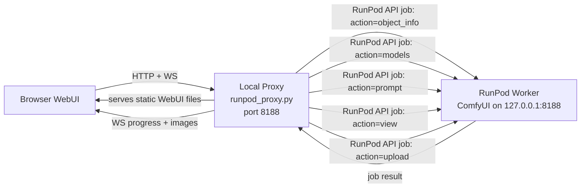

# Plan: run_webui.sh — Local ComfyUI WebUI Proxy to RunPod Serverless (Option A)

## Goal

Run the ComfyUI WebUI locally and proxy ALL API calls to the RunPod serverless
worker via the RunPod job API. No model syncing, no local GPU, no local ComfyUI
backend needed. The RunPod worker already has everything — models, custom nodes,
ComfyUI itself.

## Architecture



## Core Concept

The RunPod serverless handler (`src/handler.py`) already starts ComfyUI on
`127.0.0.1:8188` inside the worker. We extend the handler to accept additional
"action" types beyond just `workflow`, turning it into a full ComfyUI API proxy:

| Action | ComfyUI Endpoint | RunPod Job Input |
|--------|-----------------|------------------|
| `prompt` | `POST /prompt` | `{"input": {"action": "prompt", "workflow": {...}}}` |
| `object_info` | `GET /object_info` | `{"input": {"action": "object_info"}}` |
| `models` | `GET /models` | `{"input": {"action": "models"}}` |
| `view` | `GET /view?filename=...` | `{"input": {"action": "view", "filename": "..."}}` |
| `upload` | `POST /upload/image` | `{"input": {"action": "upload", "image": "base64..."}}` |
| `history` | `GET /history` | `{"input": {"action": "history"}}` |
| `queue` | `GET /queue` | `{"input": {"action": "queue"}}` |
| `embeddings` | `GET /embeddings` | `{"input": {"action": "embeddings"}}` |

## Key Design Decisions

### Use `/runsync` for read operations, `/run` for prompts

- **Read operations** (object_info, models, view, history): Use `/runsync`
  (synchronous — waits for result). These are fast and return immediately.
- **Prompt execution**: Use `/run` (async — returns job ID immediately).
  The proxy then polls `/status/{job_id}` for progress and sends WebSocket
  updates to the browser.

### Caching

- **object_info**: Cache for 5 minutes (rarely changes during a session).
  This is the most expensive call (large JSON) and is called on WebUI load.
- **models**: Cache for 5 minutes. Only changes when models are added.
- **view/images**: Cache locally after first fetch (output images don't change).
- **prompt/history/queue**: Never cached (always live).

### WebSocket Progress Simulation

The proxy polls the RunPod job status every 1-2 seconds and sends WebSocket
events that match ComfyUI's expected format:

```json
// Queue position
{"type": "status", "data": {"exec_info": {"queue_remaining": 1}}}

// Node executing
{"type": "executing", "data": {"node": "6", "prompt_id": "abc123"}}

// Progress
{"type": "progress", "data": {"value": 45, "max": 100}}

// Node completed with output
{"type": "executed", "data": {"node": "9", "prompt_id": "abc123", "output": {"images": [...]}}}

// Execution complete
{"type": "executing", "data": {"node": null, "prompt_id": "abc123"}}
```

### Static WebUI Files

The ComfyUI WebUI frontend is static HTML/JS/CSS. We have two options:

**Option 1: Bundle with the proxy** — Download the ComfyUI frontend files
once and serve them locally. The frontend is version-independent (works with
any backend version).

**Option 2: Fetch from worker** — On first load, submit a job to fetch the
static files from the worker's ComfyUI. Cache locally.

Option 1 is simpler and more reliable.

## Implementation Plan

### Step 1: Extend `src/handler.py` — Add action routing

Add an `action` field to the handler input. When `action` is present and not
`"workflow"`, route to the appropriate ComfyUI API call instead of the normal
workflow execution path.

```python
def handler(job):
    job_input = job.get('input', {})
    action = job_input.get('action', 'workflow')

    if action == 'workflow':
        # Existing workflow execution path
        ...
    elif action == 'object_info':
        return get_object_info()
    elif action == 'models':
        return get_models()
    elif action == 'view':
        return view_image(job_input)
    elif action == 'upload':
        return upload_image(job_input)
    elif action == 'history':
        return get_history(job_input)
    elif action == 'queue':
        return get_queue()
    elif action == 'embeddings':
        return get_embeddings()
```

Each action handler makes a simple HTTP request to `127.0.0.1:8188` inside
the worker and returns the result.

### Step 2: Create `src/runpod_proxy.py` — Local proxy server

A lightweight HTTP + WebSocket server that:
1. Serves static ComfyUI WebUI files (downloaded once, cached locally)
2. Intercepts API calls and translates them to RunPod API jobs
3. Manages WebSocket connection to the browser
4. Polls RunPod job status for async prompts
5. Caches responses (object_info, models)

Uses `aiohttp` or `fastapi + uvicorn` for async HTTP + WebSocket support.

### Step 3: Create `scripts/run_webui.sh` — Launcher script

```bash
#!/bin/bash
# Launches the local ComfyUI WebUI proxy to RunPod serverless
# Usage: ./scripts/run_webui.sh [--port 8188]

# Requires: RUNPOD_API_KEY, RUNPOD_ENDPOINT_ID in env or .env
# Starts: src/runpod_proxy.py
# Opens: http://localhost:8188 in browser
```

### Step 4: Download ComfyUI frontend files

The proxy needs the ComfyUI WebUI static files. On first run:
1. Download ComfyUI release tarball from GitHub (just the `web/` directory)
2. Extract to `~/.cache/comfyui-web/` (or similar)
3. Serve from there

This is a one-time download (~5MB, the frontend is small).

## File Structure

```
scripts/
  run_webui.sh          # Launcher script

src/
  runpod_proxy.py       # Local proxy server (HTTP + WS)
  handler.py            # Extended with action routing (modified)
```

## Cost Considerations

Each API call to the RunPod serverless endpoint spins up a worker (if none
are idle) and bills for the execution time. To minimize costs:

- **object_info + models**: Cached for 5 min → 1 job per 5 min
- **prompt**: 1 job per workflow execution (unavoidable)
- **view/history**: Cached per session → minimal jobs
- **upload**: 1 job per image upload

With 3 idle workers already running (as seen on the dashboard), most calls
will hit an idle worker with no cold-start delay.

## Usage

```bash
# Set up
export RUNPOD_API_KEY=your_key
export RUNPOD_ENDPOINT_ID=taea2mhlwbdkuq

# Launch
./scripts/run_webui.sh

# Opens browser to http://localhost:8188
# Full ComfyUI WebUI — models, custom nodes, workflows all from RunPod
```

## Advantages Over Alternatives

- **No model syncing** — everything comes from the RunPod worker
- **No local GPU** — all execution on RunPod
- **No local ComfyUI backend** — just the static frontend + proxy
- **Full WebUI experience** — models, custom nodes, progress, outputs
- **Scales with RunPod** — multiple workers handle concurrent requests
- **Pay per use** — no persistent pod billing

## Tradeoffs

- **Latency**: Each API call has RunPod round-trip latency (~100-500ms)
- **WebSocket progress**: Poll-based (1-2s delay vs instant on direct connection)
- **Cost per API call**: Each call is a RunPod job (but cached calls minimize this)
- **Cold starts**: If no workers are idle, first call waits for worker startup
